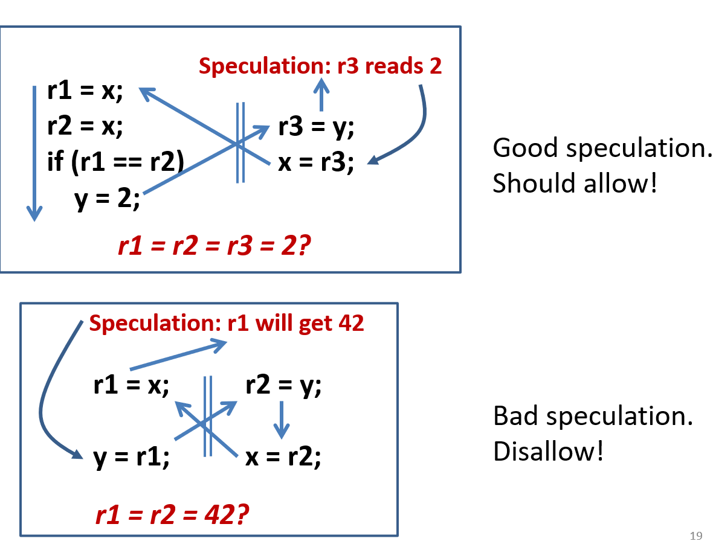

描述并发程序的行为（线程之间的内存读写操作的效果关系）是什么。

SC model，interleaving semantics. 这是在实际写程序、reasoning时，最想要看见的内存模型。

但仍然需要更弱的内存模型。所写的程序，和程序的执行，有编译器和硬件两个gap，因为效率原因，会产生更弱的内存行为。Memory Model是跨越两个gap，直接建立源程序和结果的（不确定性）关系。

[1]. store buffer 例程，读写重排。

Model Design Criteria: 

1. （模型可用性（对于reasoning?））DRF Guarantee: 无 read-write / write-write conflicts（同时访问同一内存单元，且其中一个是write）的程序行为与SC模型下一致.
   1. a data race occurs when when have two concurrent conflicting operations
   2. **conflicting**: two access the same memory location and at least one is write.
   3. **concurrent**: differ across memory models. Java: are not ordered by happens-before.
   *. 判断DRF时（data race的定义），是在目标模型下的data race定义，这也是DRF Gurantee的目标。尽管可以研究，没有“目标模型data race”，对弱模型的data race到底意味着什么。
2. Not too strong
   1. describe optimizations & hardward behaviors （可以表达各种优化和机器行为带来的不确定性（很复杂！），这某种程度上是实践可用性，是否可以用在现实的编译器+体系结构上）
3. Not too weak
   1. type safety, security.

## HMM -> JMM

基于关于程序执行公理的定义，不好用，仍然有许多问题。

程序执行：看作一系列的事件（这里事件顺序当作和语句顺序一致？TODO） + 之间的序（由线程内的progress和跨线程的switch关系构成）的集合。

Happens-before order. 两个事件e1 e2间有happens-before关系，当存在一种程序执行，e1 关于$po\cup sw$ 的传递闭包可以到达e2.

HMM（Happens-before memory model）.
*. read can see （适当不确定性的引入）
    1. most recent write that happens-before it （拓扑序紧紧在读之前的，可以有多个）
    2. write without happens-before relation. （一个没有关系的写（考虑了reorder））
问题：验证“speculation”，导致out-of-thin-air. *考虑读另一个线程的写时，没有考虑两者间的数据依赖。*

很重要的是，使用HMM的方法，是在一个已有的执行结果上（每个读的值确定，每个写的值确定）进行验证，而这个验证不能排除环（happens-before order没有考虑多个指令的关系，进而没有禁止数据依赖的环）。进而这个执行结果若有一些thin air value，HMM无法发现。

JMM 是在 HMM上的拓展，额外增加了9条公理去限制不确定性。它很复杂，并引入了一些奇特行为。
* 增加更多的同步语句，可能会增加程序行为
* inlining threads也可能增加程序行为
* 重排独立指令可能改变行为
* 增加或去除无用读可能会改变行为

http://www.cs.umd.edu/~pugh/java/memoryModel/

http://openjdk.java.net/jeps/188

注意到，线程内的数据依赖而维持的序，可能由于其他线程的加入而被破坏。我理解为复杂缓存参与——还在缓存中的写被其他线程直接读了，并率先写入了内存，导致更早的缓存中的读（还没有发生）可以读这个写，而这个写来自于自己后面的写。