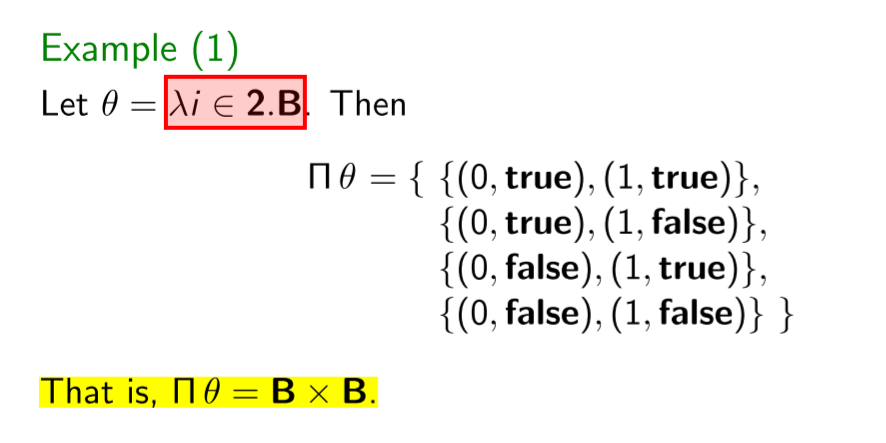
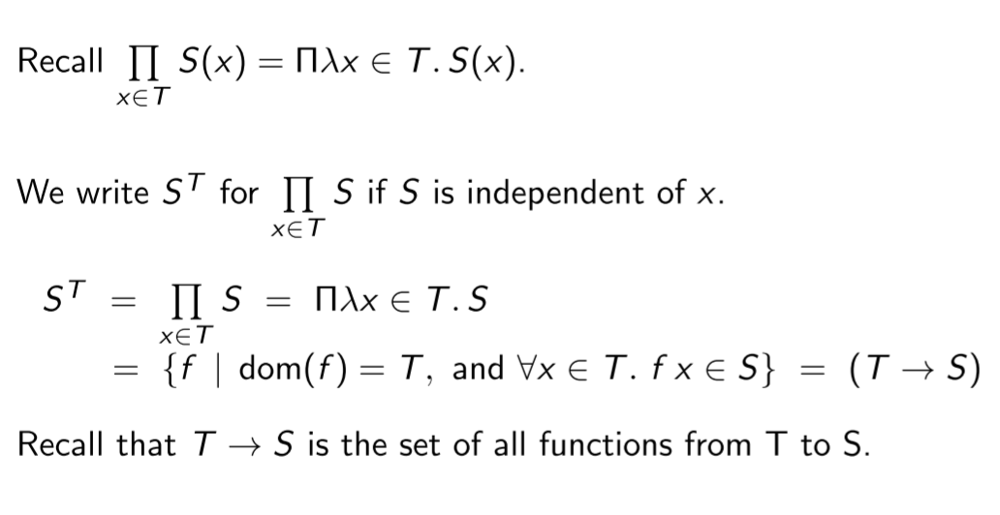
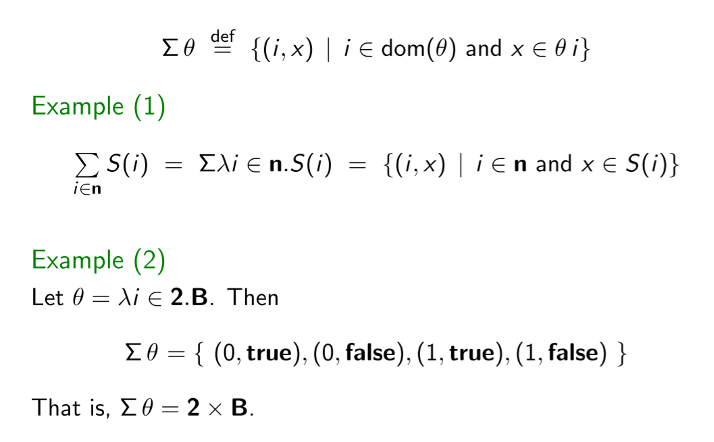

# 0x03 一点数学

## Symbol

一些符号的latex标识: 自然数，整数，bool

$$

\mathbb{N}\;\mathbb{Z}\;\mathbb{B}.

$$

## Sets

Generalized集合符号，Generalized Unions/Intersections of Sets.

不会证明呀.. $\exists$要怎么建立和$or$的关系. 是否可以destruct $\{A, B\}$

$$
\bigcup_{i=m}^{n} S(i)  \\
$$

注意$\bigcap \emptyset$无意义，set of everything. “x属于空集中的每个集合”对于任意元素x都成立。

$$
\bigcap S = \{x\;|\;\forall T \in S. \; x \in T.\}
$$

## Relations

1. 定义1，笛卡尔积，Projections over pairs $\pi_{0/1}(x,y)$.
2. $\rho$ is a relation from A to B if $\rho \sube A \times B$, or written as $\rho \sube \mathcal{P}(A \times B)$
3. $\rho$ is a relation on S if $\rho \sube S \times S$
4. $x\;\rho\;y$
5. $rho$ is an identity relation: $\forall (x,y) \in \rho.\; x=y$. 没有要求作用域值域.  

1. identity of S
2. domain, range 两者都是“全”集，不大不小 
3. composition of $\rho$ and $\rho'$ : $\rho' \circ \rho = \{(x,z)\;|\;\exists y.(x, y) \in \rho\;\wedge\;(y,z)\in \rho')\}$. 符号是“从右向左”的，第一个输入在最右侧.. 和 $x\;\rho\;y$的不完全一致.（和写函数的方式类似）
4. inverse

> [math font I can use](https://tex.stackexchange.com/questions/58098/what-are-all-the-font-styles-i-can-use-in-math-mode) 

属性：
1. composition的结合律
2. id是composition的左右“幺元”
3. composition与逆的关系
4. 与空关系compose，得到空
5. $dom(\rho) = \emptyset \Leftrightarrow \rho = \emptyset$. 问题：$dom$ 换成 $ran$ 也成立吗？
   
自反 + 对称 + 传递 = 等价

## 函数

是特殊的关系：同一个自变量，因变量唯一

$(g\circ f)\,x = g(f\;x)$

单射函数的反函数也是函数

functions denoted by typed lambda expressions: $\lambda x \in S.E$ denotes the function f with domain S such that $f(x) = E$ for all $x \in S$. 匿名函数.

variation of a functions: 让函数在输入x下的值变为n，x可能不在原本f的定义域下(此时相当于定义域扩大了一项).

$$

f\{x \rightsquigarrow n\} 

$$

Function Types, right associative $A \rightarrow B \rightarrow C = A \rightarrow (B \rightarrow C)$.

Currying.

## Products

Generalized Cartesian Products. n-tuple. 

Tuples as Functions. 将(x,y)视为一个函数，输入0时得到x，输入1时得到y. 此时笛卡尔积可以看作函数的集合.

$$
A \times B = \{f\;|\; dom(f) = 2, and\;f\;0 \in A\;and\;f\;1 \in B \}
$$

这种定义的调整可以拓展到n-tuple.

进而可以拓展到无数元的tuple. 无限个集合做笛卡尔积.

$$

\prod_{i=m}^nS(i) = \prod_{i\in[m,n]} S(i) = \{f\;|\;dom(f)=[m,n], and\;\forall i\in [m,n]. f\;i\in S(i)\}

$$

$\sqcap\theta$中，$\theta$是一个函数，因变量是一个set.

$$

\sqcap\,\theta = \{f\;|\;dom(f) = dom(\theta), and\;\forall i \in dom(\theta).\;f\;i\in\theta\;i\}

$$

当$\theta = \lambda i.E$且E不随i改变时（E应是几个集合），$\sqcap \theta = E \times E \times E...$  E的数量等于$dom(\theta)$，所以$\sqcap \theta$中的每一项都是一个作用域为$dom(\theta)$、值域为$E$的函数.

$\sqcap \emptyset = \{\emptyset\}.$ $\emptyset$也是函数（函数就是一个特殊的关系，包含一个集合的pair），只不过这个集合不包含任何pair.

If $\exists i\in dom(\theta).\; \theta\;i = \emptyset$, then $\sqcap\theta = \emptyset$. 当我们记住$\sqcap$是笛卡尔积的拓展，这一个Example是比较容易理解的（笛卡尔积连乘时，中间任何一个为空，结果为空集）。这就要求，$\theta$的输入必须都有意义。

> 这个$\theta$的意义还不是很清晰：为什么要构造这样一种表示？

Exponentiation: 当E与i无关，它就是$dom(\theta)$到E的所有函数！注意，T作为指数，含义是做T次“笛卡尔积”，每一次笛卡尔积引入一个作用域点. 或者解读为，将T中的每个点都映射到S中.

$2^S$ 因而可以表示超集$\mathcal{P}(S)$.

## Sums (or Disjoint Unions) 不交并

就是加上集合的标号，然后合在一起。

$A + B =\{(i,x)\;|\;i=0\;and\;x\in A,\; or \; i = 1 \; and \; x \in B\}$

一样，可以被generalized 带 n个集合的不交并. 可以用在无限个集合上.

此时$\theta\;i$的i成了集合的标号

$\Sigma \empty = \empty.$

If $\forall i \in dom(\theta).\;\theta\;i=\empty, then\; \Sigma\theta = \empty.$ 

不交并和笛卡尔积的关系更简单：若S(x)与x无关，

$$

\sum_{x\in T}S = \Sigma\lambda x\in T.S\\
= \{(x,y)\;|\;x\in T\;and\;y\in S\} \\
= (T\times S)

$$