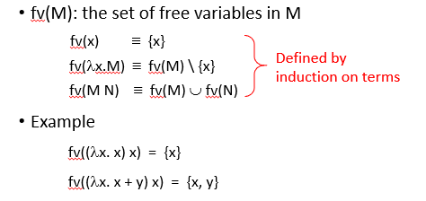
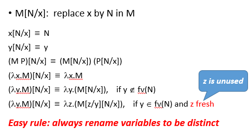
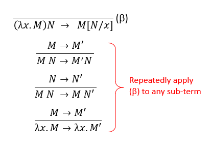

# Lambda Calculus

1. functions of rules, 关注 how the function is to be calculated. 此时一般不需要了解函数的domain/codomain. 很多时候，我们也更关注这部分的中间过程。
2. untyped lambda-calculi 由于完全无类型，有些运算无意义，如无限递归，$\omega = \lambda x.x(x)$
3. 与turing machine / general recursive functions 在可计算性上等价；是simplest possible PL that is Turing complete.
4. Lambda Calculus 与 建构主义逻辑 紧密相连，Proofs as Programs. 建构主义指，一个证明必须是一个 `construction`, 也就是一个program.
5. 将lambda calculus 应用于数学模型之上，可以更好理解其意义（如代数，偏序集、拓扑学、范畴学...）

## Untyped Lambda

### overview

1. definition: variables / applications / lambda abstractions
2. convention: $\lambda$的作用域到最远，func_apply是左结合的
3. 括号太多，所以有括号convention
4. free \& bound variables, $\alpha$-equivalence. 替换规则的第一步（rename）. rename的递归定义；许多数学领域都有free/bound variables的概念，如微积分符号，lim，$\sum$，c程序的函数.【要注意free variable的name是重要的；bound variable就是个placeholder，可以被替换。】
5. 替换（substitution），注意有时需要rename（用作替换的term中的free variable，在被替换结束后，仍然需要是free的；进而在遇到bound variable时，需要（先）重命名bound vars，再进行替换，保证不与替换term中free var重名）. $\lambda x.M=\lambda y. M[y/x]$, 只替换free variable（被暴露出来的、没有被约束的变量）

   1. rename也是一个substitute，但我们会选择一个fresh variable，替换它时不必考虑再次rename别的bound variable.

      
6. $\beta$-reduction. A lambda term without any $\beta$-redexes(reductive expression, $(\lambda x.M)N$) is said to be in $\beta$-normal form. 要替换（因而要考虑rename）. 第四条规则强调，函数体也要reduce。概念：evaluates to (normal form). $\beta$-redex, $(\lambda x.M) N$, beta-normal-form，不存在beta-redex的term. -> 意味着不能再apply beta rule

   实际做reduction时，注意后三个rule都可以用，也就是先reduce参数会比较简单。

   Not every term evaluates to somthing(因为无线递归结构). 注意，TODO，课件上的reduction与evaluation有区别. $\beta$-equivalence.

   

> lambda calculus 的四条reduction rules，一条beta rule是最核心的（application 形式，其中func已经暴露了一个参数(就是一个lambda)，不能是一个变量或者一个带括号的复杂term），另外三条rule是用来运用beta rule的(有些contextual semantics的感觉)，当目前的term是一个application时，可以任意在func/param运用beta reduction（因而这里有语义的歧义）；当目前的term是一个abstraction时，可以让函数体运用beta reduction。

#### beta normal form

beta redex(reducible expression(term)), a term of the form ($(\lambda x.M)\;N$), 也就是application形式的term。

beta normal form: term containing no beta-redex，无法在调用beta reduction rule了！

##### Formalizing Confluence

合流性（Confluence），Church-Rosser Property: 以任何顺序（因为语义是歧义的）去规约lambda term，如果能得到最终结果（可能diverge），那么结果一致（意味着唯一）。【一个term，走不同的分支，最终都会汇聚到某个相同term（exists）】

1. step: $M\rightarrow^* M'$. first define $\rightarrow^k$ inductively.
   1. $M\rightarrow^0 M'$ always holds
   2. $M\rightarrow^{k+1} M'::= \exists M''.M\rightarrow M'' \wedge M'' \rightarrow^k M';$ 可以前向，可以后向
   3. $M\rightarrow^* M' ::= \exists k.\; M\rightarrow^k M$.
2. confluence theorem: $\forall M.\;(\exists M_1, M_2.\;M\rightarrow^*M_1 \wedge M\rightarrow^*M_2)\longrightarrow(\exists M'. \;M_1\rightarrow^*M' \wedge M_2\rightarrow^*M')$.

> confluence theorem的实际定义的视角看起来有一点不同，它把non-termination也直接包含考虑了，它在说，如果选择了两条策略，无论如何，两条策略都能找到一个交汇点（交汇点不一定是normal form）。是一个很强的定理。
>
> 正确性源于reduce一侧时没有丢失或影响另一侧的信息（大概就是副作用了）
>
> 意味着：任何term都有最多一个normal form. 但是可能，有的beta redex选取策略会导致不终止（找不到），而其他策略能找到。（reduction strategies）

> non-terminating 可以通过类型检查找到（？）
>
> 一些term没有normal term，一些term有两者。

reduction strategies:

1. normal order, leftmost, outermost (定理：如果能找到，按照normal order reduce，总能找到normal form)（从外向内会完全利用语义信息（类型信息）），接近call-by-name，先将每个参数代入，再evaluate -> 优先走一定会走的逻辑！也就是最外侧的逻辑！
2. applicative order, leftmost, innermost, 好处是步数可能变少（会复用重复reduce）。不过可能有大量的argument没有被使用，applicative order效率会低。接近call-by-value，算一个参数的值，带入这个参数，再考虑下一个参数

```
> 注意，这里考察的都是redex间的包含关系
leftmost:
whose lambda is left to any other

outermost:
not contained in any other

innermost:
not contain any other
```

### Programming in untyped lambda calculus

> 关于bool运算的encoding，可以从数据流的角度去理解其正确性（not/and/or/if/not'），很有趣。可以写个小文章。

1. 表示Bool与基本运算/自然数/Pair/Tuple/List/trees. Encoding可以有多种定义方式。
2. 基于List之上可以表示新的自然数，比直接基于lambda-calculi的更有效（$\beta$-reduction次数更小）
3. 解Recursive Function：Fixpoints. *In the untyped lambda calculus, every term F has a fixpoint*, 所以可以解递归方程.

课件上：

Reduction Strategy & Evalutation Stratygy

1. Reduction Strategies: normal-order, 最左侧，最外侧的redex先reduce. 这个方式一定会找到normal form, if exists. (走必须经过的路径) ；Applicative-order reduction, 最左侧，最内部的redex优先，此时是可能陷入死循环的.
2. Evalutation Stratygies: 什么时候 evaluate the arguments of a function call, and what kind of value to pass to the function.

> **课件上强调reduction与evaluation的区别，就是在是否要规约函数体内部而已。**（感觉就是两者的场景不一样，evaluation偏向于更复杂的编程语言的场景，不会在函数内部进行evaluate）

20.8.11记：Reduction 与 Evaluation的区别应该就是：reduction是一直reduce到normal form为止，normal form相当于原先函数的最简化，allow optimizations, 可能会遇到无限的场景，最后可能得到一个最简单的lambda abstraction（所谓的“函数”）, 可能只是一个变量（不再有“栈”）。Evaluation是到一个lambda abstraction($\lambda x.M$)就停下（感觉可以理解为，运行时最终还是在栈上...），only evaluate closed terms(no free variables) ，因为嵌套地进行evaluate的是“被固定的参数”。

> normal-order evaluation也可能不终止。避免了少部分。

normal-order evaluation rule 用了一种大步的定义（没有办法建立evaluate k步的含义，直接是0/n步直接到结果的含义；没有办法建立partial evaluation） (可以通过调整rules的定义，直接限制reduction order)。也可以用小步的形式（少了两条rule，一条是因为到canonical form停止，一条是因为normal order的限制；两种定义方式是否可以是同样的效果，我认为后者可以表示前者；大步可以增加一个递归次数的表情，但是处理无限的情况可能会出现问题）。

eager evaluation rules: 当参数是canonical form，才做beta reduction. 避免带入后重复的evaluation. （感觉这个应该就是call by value...）。可以写big step/small step两个版本。

几个练习：Find lambda terms then represent each of the following functions.

1. f(n) = iseven(). 但是无类型， = 也没有定义，似乎不对. 希望找到一个函数F, F(x) = y, F(y) = x. 事实证明，思维被iszero固化了. iszero $\lambda n\;x\;y.\;n\;F\;T$ 的形式，输入自然数后效果是将F应用m次，由于iszero太简单，所以直接在x,y bound的情况下，设计F就可以. 如果iseven也以这种形式设计，必然需要做等于判断，因为x是bound的. 但显然，我们只需要不断翻转true/false就可以. 很轻松就可以跳出这个思维框架.

$$
\lambda n\,x\,y.\, n \; (\lambda z. \;if\_then\_else\; (z = x)\; y\; x)\; x (不好)\\
iseven := \lambda n.\;n\;(not)\;T
$$

2. $f(n) = (n+3)^2$, 只需要把add/mult写进去就好了，最多可以reduce，但会不够直观.

$$
\lambda n.\;mult\;(add\;n\;3)\;(add\;n\;3)
$$

3. $exp(n,m) = n^m$ 只需要将(mult n)重复m次嘛。

$$
\lambda n,m.\; m (mult\;n)\;\overline{1}.
$$

4. $pred(n) = n - 1$ reduction rule只允许我们将一个term替换为另一个term，不过term不能为空. 所以我们必须用全新的思路构造pred: 生成的思路. 我们从(0, 0)开始找，fst为前面的数，snd为当前的数，一旦当前的数等于n，我们返回fst. (当我们记不住某个英文字符的前一个是什么，就要重头背一遍...). 我们需要一个结构存储两个数，并且做n次转移.

> [参考](http://gettingsharper.de/2012/08/30/lambda-calculus-subtraction-is-hard/)

$$
Pred := \lambda. (n\; Trans\;(MkPair\;\overline{0}\;\overline{0})) Fst\\
Trans := \lambda p.\;MkPair\;(p\;Snd)\;(Succ(p\;Snd))\\
MkPair := \lambda ab.\;\lambda s.\;(sab)\\
Fst := \lambda ab. a\\
Snd := \lambda ab. b
$$

基于此，我们可以定义减法。

### fixpoint

当我们将递归方程写成fixpoint equation形式时，我们就已经把约束全部融入这个等式$f = F\;f$之中了. 我们要求的解，就是F的fixpoint，且任何一个都可以. 也就是说，我们用任何一个combinator求解，也都可以.

> fixpoint combinator: 计算一个函数的fixpoint的函数

> 可以表达不动点，就可以表达递归函数

解方程时，完全绕过了fixpoint的真实表达式，就是在不断反复用F规约. 每次单独遇到fixpoint，都根据$\Theta F\twoheadrightarrow F(\Theta F)$替换.即，我们无法直接reduce fixpoint到底（因为没有底），我们只能一步一步解析输入参数、并用上述等式替换，直到到达递归终点（如果函数被正确定义了的话）.

> $\Theta = AA\\A = (\lambda xy.y(xxy))$ .

### 其他数据结构：Pair/Tuple/List/Tree

#### Pairs

Pairs: $<M, N>$ => $\lambda z. z M N.$ 有一个参数，是“选择子”.

Left: $\lambda p. p(\lambda x y.x).$

Right: $\lambda p. p(\lambda x y.y).$

#### Tuples -- Extension of Pairs

$\langle M_1, ...,M_n\rangle$ = $\lambda z. zM_1...M_n$.

$\pi_i^n = \lambda p.p(\lambda x_1...x_n.x_i)$.  是Left/Right的拓展.

#### List

$nil = \lambda xy.y$

$H::T = \lambda xy.xHT$.注意，这里的H/T不是参数，就是一个连接链表的语法糖.

熟悉一下list的（递归）方程$addlist\; l=l(\lambda h\;t.add\;h(addlist\;t))(\overline{0})$. 它很像foldr...，l接受的第一个参数是如何accumulate H 与 T的解，l的第二个参数是到达nil了，我们的递归终点，此时返回值是什么.

#### Trees

$leaf(n) = \lambda xy.xn$
$node(L,R) = \lambda xy.yLR$

这里的定义，内部节点没有value.

熟悉一个函数：$addtree\;t=t(\lambda n.n)(\lambda l\;r.add(addtree\;l)(addtree\;r)).$ leaf和node都接受两个参数，但是，leaf只使用第一个，node只使用第二个.

#### 练习

> 都需要用一般的fixpoint处理方式简单处理一下

1. $len\_of\_list\;l = l(\lambda ht.\;succ(len\_of\_list\;t))\;\overline{0}$
2. $depth\_of\_tree \;t=t(\lambda n.\overline{0})(\lambda lr.succ\;(\;max\;(depth\_of\_tree\;l)\;(depth\_of\_tree\;r))$

> 差两个，头脑迟钝，以后再想.（max a b，sort l）
