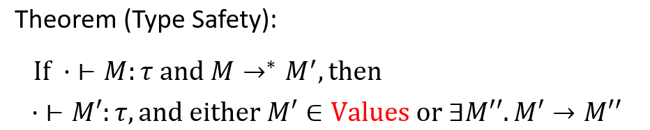

# 0x05 Untyped Lambda Calculus

在LC的notation基础上，增加了类型标记，并复杂化了reduction rule. 也就是type system.

why types:
1. Well-Typed programs will not go wrong. 可以保证never reach a meaningless(depend on semantics) state. (types errors and others run-time errors).
2.  A Well-Typed terms in STLC always terminate.
3.  Typed programs are easier to analyze and optimize.

一部分合法程序会被拒绝.

formal type systems, a precise specification of the type checker, and allows formal proofs of type safety.

## Type system

### Simple

1. Typing rules.
2. Type safety, soundness of typing rules.

> 设计函数的类型：argument and result types.. function body 中的 free variables(context).
> 
> 设计struct的类型、union的类型

Typeing rules:


sound & completeness : sound, no false negatives; complete, no false positives. 没有办法同时保证（判断）一个程序是sound且complete的(undecidable). Choose soundness, try to reduce false positives in practice.

什么是soundness：the reduction of a well-typed term, either diverges, or terminates in a value of the expected type. Followed by:  

1. Preservation: well-typed terms reduce only to well-typed terms of the same type.
2. Progress: a well-typed term is either a value or can be reduced.



什么情况体现了not complete? $x:\sigma\vdash(x(\lambda y.y))(x\;3):\tau$ 被reject. Reject的原因在于，我们无法让x同时符合两个类型（因为 x \lambda, 与 x 3）. 但是此时让x是一种更general的类型（template，使得$\lambda z.z$)，却可以合法.

Well-typed terms in STLC always terminate. (strong normalization theorem). $(\lambda x.x\;x)(\lambda x.x\;x)$ 不合法，cannot be assigned a type.

### More (基本类型系统之上的拓展)

Product type(struct). 类型系统中增加 $\theta\times\tau$, 语言中增加pair，proj.

需要证明仍保持soundness theorem.

Sum type(union/subclass). 类型系统增加 $\theta + \tau$，语言中增加left, right, case M do M1 M2. 这里的标记不太懂：如何用两个指定subtype构造一个union? left, right似乎只是用于任意拓展的？（似乎就是要任意指定，因为这两个类型可以毫无关系，所以reduction rule/type inference rule中，就是我拓展成一个union，union的第i项（对应这个类型本身）是符合的，...）

> 对于 case M do M1 M2. M 是 union, M1 M2 分别是union的第一个类型/第二个类型要做的事情. 

`Logical duals`:
* To make a $\sigma\times\tau$, we need a $\sigma$ `and` a $\tau$.
* To make a $\sigma + \tau$, we need a $\sigma$ `or` a $\tau$.
* Given a $\sigma\times\tau$, we can get a $\sigma$ or a $\tau$ or both. (相当于我们可以从两个类型中“选择”，our “choice”).
* Given a $\sigma + \tau$, we must be prepared for either a $\sigma$ or a $\tau$ (我们需要为任何可能的里欸行都做准备，“the value's choice”)

### Recursion (Fixpoint)

Fixpoint combinator: a higher-order function h satisfying: forall f, (h f) gives a fixpoint of f, i.e. h f = f(h f).

目前，Strong normalization theorem要求 well-typed terms in STLC always terminate. 我们不能直接引入fixpoint combinator(无法规定它的类型)，所以我们额外的增加一个“explicit construct for recursion”——类型系统不改动（类型系统不能支持fixpoint），在语言中增加`fix M`关键字。M的function body中自然要调用自身. M的类型为$\tau\rightarrow\tau$, fix M的类型则为$\tau$. 此时，strong normalization theorem 已经没了.

关于Fixpoint最重要的reduction rule：$fix\;\lambda x.M \rightarrow\; M[fix\;\lambda x.M/x] $. 函数体中实际x的部分，都可以任意的展开为自身，fix 修饰的abs的变量x，就是这个函数，M是真正的每次（单次）递归的执行体，x是“从这个点一致递归到终点，如果可以的话”这样一个函数. 

> $m$ 和 $\lambda x. M$的关系，很值得思考.

看一看这个：

```
fix \lambda f. \lambda n. if (n == 0) then 1 else n * f(n-1)
```

f对应x，\lambda n到最后对应M. M的类型是nat->nat, f 的类型也是nat->nat，那么fix的修饰部分的类型就是(nat->nat)->(nat->nat), 加上fix就成了(nat->nat).

## Connection to constructive propositional logic

Curry-Howard isomorphism, "Propositions are Types", "Proofs are Programs".

what logicians do: define lofic propositions, and define a proof system to prove "good" propositions.


一个well-typed closed term，等价着一个谓词逻辑的推理. Context 意味着 Assumption.


> type 中 有 `非`吗? 应该没有，需要用蕴含去改写. not p := p -> false

Curry-Howard isomorphism: 
1. A term that type-checks is a **proof**. 直接直到如何derive the logic formula corresponding to its type.
2. Lambda 与 蕴含相关：Constructive propositional logic and STLB with pairs and sums are the same things.
3. Given a well-typed closed term, take the typing derivation, erase the terms, and have a propositional-logic proof 
4. Given a propositional-logic proof, there exists a closed term with that type 

类型系统不只是一堆rules，它对应着一个proof system.

Classical vs. constructive:
1. 一部分Classical Propositional logic 规则是不包含的. 比如吸收律. （这意味着：Formulae are only considered `true` when we have direct evidence. "proofs produce examples"）

STLC 无法构造出closed的$\rho+(\rho\rightarrow\sigma)$. 【这一点的意味还要想一想】，constructive logic 中不包含double negation laws，[这一点](https://stackoverflow.com/questions/21803608/are-there-propositions-that-can-be-proved-in-classical-logic-but-not-in-agda)很重要. 简言之，我们不使用排中律，非假不等于真，真命题必须被构造出来. 但有的时候，“排中律看起来明显是可用的”的情况，怎么使用排中律？或者，有没有这种情况？