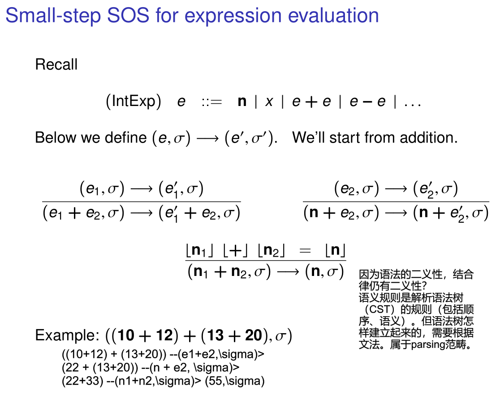
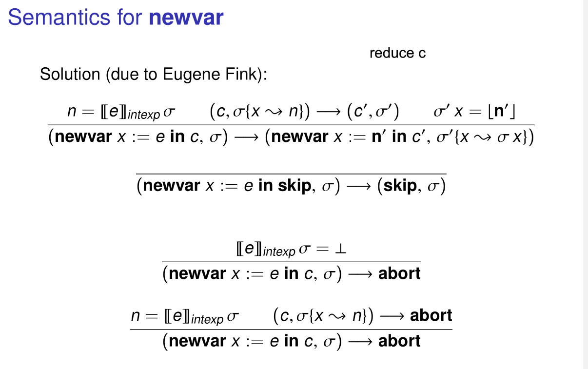

# 6. Operational Semantics

这一节讲如何形式化地描述一门程序语言的语义。

语言有两个组成，语法和语义，语法要先设计好才能给出语义定义。

定义好语法后，我们已知道语法树每一种可能的父子结构。给出语义定义，就是给出每一种父子结构的分析的方案。注意，语义和语法的二义性无关，形式语义是在描述如何在一棵已经确定的语法树（CST）上做分析。至于语法树是怎么来的，形式语义并不考虑。

可以这样想：我们的程序已经被解析了一棵树，我们要“运行这棵树”，运行之前我们有某初态$\sigma$。我们的运行过程就是这棵树递归的遍历过程，不断转换我们的状态。遍历规则按照我们的语义定义工作。

所以语义规则要考虑：(1)某个结点的类型(2)其孩子们的pattern. 以决定下一个动作: (1)选择某个孩子结点递归(2)返回上一层，意味着抵达了叶子或者短路. 返回后，结点类型和返回值也改变了. 孩子们是否符合多个pattern，决定着determinism(语法树允许了多种执行顺序)(但这不意味着结果一定是多义的).

这棵树某种意义上是“动态的”，因为reduce会改变类型，while更是会“展开”。这里就是我们会关注的可中止性(最终会到达normal form). 

> 语义就是：我们如何根据某个短语（Expression）/语句（Statement）更改状态。
> 
> Expression一般代表简单运算，比如+/-.

下面都从“分析语法树的方式”角度理解语义定义。感觉不同的描述方式没什么差异。

> 我们考虑包含 四则运算，bool运算，skip, assignment, if-else，; , while，local variable，动态分配的简单语言. 并且支持abort.

## Small-Step Semantics

1. 词法与语义要做区分，并引入了语义符号$\lfloor\;\rfloor$
2. 首先要定义终结符的语义。
3. 用什么表示状态 $\sigma \in Var \rightarrow Values$ 中的Values：语义符号 / 语法符号，都可以. 选择用语义符号.
4. configurations: $(e,\sigma)$, $(b, \sigma)$, $(c, \sigma)$.第一项我理解为待分析的子树的pattern，第二项理解为此时的状态. 注意，此时的node一般表示某个运算符, 当第一项是常量时，也就意味着有一个孩子，它是运算符的值.

### Small-step structural operational semantics (SOS)

用子结构语义表示父结构语义. 这意味着每棵子树的语义不会相互耦合，兄弟节点没有干扰。

这样理解下图（Expression）：横线上左侧config指示了下一步要分析哪个子结构. 横线下左侧代表子树此时的pattern. 右侧代表子结构语义与父结构语义的关系. 可以注意到，这是规定了分析顺序的. 当相同pattern出现了多次，也就有了多种语义分析方案.




对于command，若执行结束，是不需要携带返回值的. 也就是没有子节点. 此时忽略第一项.

While 的语义 借助 if 递归定义.

* normalizing: transition是否会终止.

### 一种改写：用统一的configuration表示状态. (x , $\sigma$)

* 增加了 $\llbracket\;[e|b]\;\rrbracket_{intexp|boolexp}\sigma=[n|bo]$ 符号, 表示在状态为$\sigma$下，表达式e/b语义为n.

和普通SOS是等价的，就是符号统一一点.

### 引入 Going wrong

就是增加额外的一个configuration: abort. 并且(1)增加产生abort的基本子句状态改变，比如0/0会导致config变为abort. (2) 每一个rule 要考虑子树是否可能是坏的. 

### 引入 Local Variable Declaration

```
c ::= ... | newvar x := e in c
```

newvar在并行语义中会很集中考虑. 语义一定要体现局部性.



### 引入 动态data

此时状态要增加一个Heap. 之前只有Store.

Heap是一个partial mapping，相同指针可能指向同一处（共享内存）. Values也增加`Loc`（地址）类型. Config也就进化为(c, (s, h)). 分离逻辑中集中考虑这一部分.

四个新statement: allocation / lookup / mutation / deallocation.

### 进一步简化表示方法：Contextual Semantics

$\mathcal{E}$. $[\;]$暗示下一个要被分析的子节点.

Redex + Evaluation contexts. 虽然说是分别考虑了local / global rule，我觉得没啥变化. 还是用“在某状态下，根据某节点和其孩子们的pattern确定下一步的执行动作”.

就是写起来更简单了，更符合我们的理解方式.

## Big-Step Semantics

Big Step似乎忽略了evaluate顺序，（我认为需要“语义”支持它这么做：如果对于`e1 + e2`，evaluate的顺序很重要，那么就不能用BigStep去写）. 

Small Step 是线性结构，Big Step是树的结构；Small Step是语法树树按照准确语义规则的对语法树做遍历，的状态转移链条；树结构损失了具体的“我要执行哪个子树..”等，只想关注结果，不想关注遍历顺序. 默认就理解为：横线上面的各子树，可以并行分析，最后统一结果.

Big-Step在分析状态时有局限, 因为它不能保留中间“哪一步出现了错误”，也就是Small-Step中config的第一项.

## 以Untyped Lambda Calculus为例

若直接按照ULC语法写语义，得到的rules就是non-deterministic的. 因为对于 $M,N :== M N$ 这一项，想先执行那个子树都不影响结果. 此处也能看出函数式编程的no side-effect特性，完全依赖reduce/map，没有全局状态.

> 问题：什么时候可以说“Big-Step”与“Small-Step” Semantic是equivalent的？对于某个语言，的任何一棵语法树，分析结果都是相同的（都不normalize 或 最终config都一致？）。