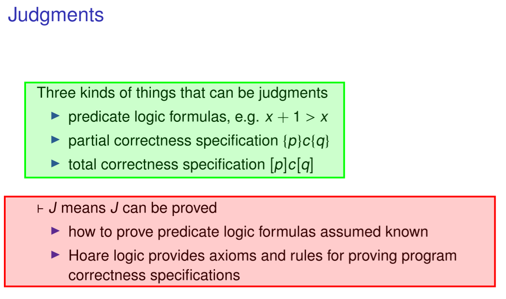

# 0x07 Hoare Logic

1. 自动程序证明：在关键的地方插入assertion，程序生成一堆VC，转为验证这些VC是否是全真的。并不一定一定可以找到derivation，但可以找到大部分。

2. Soundness & Completeness

最重要的还是**定义**. 这一部分讲的Soundness && Completeness是最重要的。Soundness 意味着 $\vdash\{p\}c\{q\}\Rightarrow\models\{p\}c\{q\}$（所有可以derive出来的，都是Valid的）, Completeness与之相反（所有Valid的，都可以被推导规则derive出来）。显然我们要满足Soundness。我们的逻辑要分两层，Hoare Logic和其底层的谓词逻辑（可以用其他逻辑），Hoare Logic本身是（Partial）Complete的，如果底层逻辑是Complete的。谓词逻辑的Completeness受哥德尔不完备性定理限制。

$\vdash p$ : there exists a proof or derivation of $p$ following the inference rules.

$\vdash\;\{p\}c\{q\}$ : There is a derivation of {p}c{q} following the rules.

总之：$\vdash\;J$ means J can be proved. Can be Proved 意味着 有一个 derivation. 不论J是谓词(assertion)、Hoare Triple(specification).

$\sigma\models p$ : p(is an assertion) holds (is true) in $\sigma$, or $\sigma$ satisfied p. (p直接在$\sigma$下，根据assertions semantics完成计算（true or false）)

$\models p$ : p is valid. forall $\sigma$, p holds in $\sigma$.

$\models\;\{p\}c\{q\}$ : Represent the meaning of {p}c{q}. 即从任何满足p的状态$\sigma$开始，在执行了c并终止后，状态来到$\sigma'$，$\sigma'\models q$.

> $\models \{p\}c\{q\} \iff \forall \sigma,\sigma'.(\sigma\models p)\wedge((c,\sigma)\longrightarrow^*(skip, \sigma'))\Rightarrow(\sigma'\models q)$  【相应语言的small step semantics 下，语言的Hoare Logic的定义】
 
为了证明 $\vdash\{p\}c\{q\} \Rightarrow \models\{p\}c\{q\}$，

3. Weakest precondition 与 Partial Completeness的证明

Weakest Precondition: wp(c,q) is an assertion such that $\sigma\models wp(c,q)\Leftrightarrow(\forall\sigma'.\;(c,\sigma)\longrightarrow^*(skip,\sigma')\Rightarrow\sigma'\models q)$. “在执行某指令c后，使得后置状态q得以满足的最小前置状态”

An assertion language is Expressive 有表达力的：for every `c` and `q`, the weakest precondition wp(c, q) is an assertion in the language。我们可以永远找到最小前置状态。（证明：对每个子句的expressive证明，然后“compose”；while较特殊，使用了哥德尔$\beta$函数。不知道是什么。）

（应该是一个前者的简单推论）For every c and q,   $\vdash\{wp(c,q)\}c\{q\}$

Relative Completeness: $\models\{p\}c\{q\}\Rightarrow\Gamma\vdash\{p\}c\{q\}$, where $\Gamma=\{\;p\;|\;(\;\models p\;)\}$.  煦按：引入$\Gamma$是为了忽略考虑了assertion logic的表达力，想证明Hoare Logic这个“二阶”逻辑框架本身是完备的、不会引入新的InCompleteness（即表达力Expressive是足够的）。

***

Hoare Logic 如何使用于 Coq，还要看. SF 不能停呀.

***

Complete WHT: 遇到While时，不变量最难想。不变量不仅描述了数据的属性，还要包含variant的不变的性质（不变量在非b的情况下也满足（也包含非b的情况），比如 `[x > 10] while x != 10 do ... [q]`, invariant 是包含[x>=10]的. 意味着已经说明了运行时以及终止时的variant的范围；这个意义在于，variant可能以略复杂的方式递减，比如 x-=2，我们的前提、进而是invariant，需要指出x is even.）. 即为了保证 variant -> * 非b，我们需要提供相关谓词描述。

Strength / Weaken 一个 assertion，并不是true的“情况”意味着强，而是状态的“精细化”、复杂化意味着强，即状态的补充。

***

关于 $[true]c[true]$: 对于每一个assertion，我们希望它们都是true. true可以理解为“无限制”.

***

Hoare Logic Soundness proof for partial correctness.

Soundness: $\vdash\{p\}c\{q\} \Rightarrow \models\{p\}c\{q\}.$

1. lemma1: 在p被满足的所有状态$\sigma$下，如果都满足$Safe(c,\sigma,q)$, 那么$\models\{p\}c\{q\}$.

> $\models\{p\}c\{q\}$要求的合法初始状态是所有的满足p的状态（for all $\sigma$），证明中需要逐一考虑单一状态的合法性，即$Safe(c,\sigma,q)$. 

> 那么$Safe(c,\sigma,q)$，在partial correctness的意义下，要表达：在某状态起执行c，或者不终止（子情况一），或者在有限步终止后，达到的终态$\sigma'$满足q（子情况二）. 两个子情况分别证明即可，都符合$\models\{p\}c\{q\}$的形式定义. 
> 
> $Safe(c,\sigma,q) \Rightarrow (((c,\sigma)\longrightarrow^*(skip,\sigma'))\Rightarrow(\sigma'\models q))$

> 而Safe的定义，就是为了这个目的给出的。但是没看出怎么由Safe定义得到lemma1. 【思路应该是：Safe(skip)符合语义，或者将Safe(c)=>Safe(c').】

2. lemma2: $\vdash\{p\}c\{q\} \Rightarrow \forall\sigma.(\sigma\models p)\Rightarrow Safe(c,\sigma,q)$

lemma2: prove by induction over the derivation of $\;\vdash\{p\}c\{q\}$

> 首先证明base case的soundness；再证明每个inference rule的soundness（假设前提holds）
> 
> 比如对于AS，需要证明substitution的良好性质... 这部分是略繁琐的，和语义细节紧密相关。

我们将原证明拆成两个，需要证明拆分是对的：$lemma1 \wedge lemma2 \Rightarrow \models \{p\}c\{q\}$. 这个是比较好证明的。

> lemma1: $Safe(c,\sigma,q) \Rightarrow ((c,\sigma)\longrightarrow^*(skip,\sigma'))\Rightarrow(\sigma'\models q)$

> lemma2: $\vdash\{p\}c\{q\} \Rightarrow \forall\sigma.(\sigma\models p)\Rightarrow Safe(c,\sigma,q)$

>  $lemma1 \wedge lemma2 \Rightarrow\;\vdash\{p\}c\{q\} \Rightarrow ( \forall \sigma,\sigma'.((\sigma\models p)\wedge((c,\sigma)\longrightarrow^*(skip, \sigma')))\Rightarrow(\sigma'\models q))$ 
