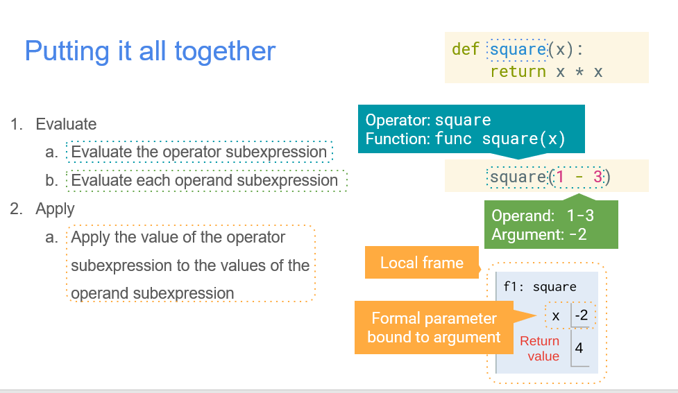

考虑这部分比较简单，笔记暂放于一个文件中。

学习目的：整理已知概念，弥补错漏。

[TOC]

## 1. Expressions

主要提到，人是由内而外分析一个表达式（evaluate to a value），机器自然要自顶向下先做解析了。

Evaluate的顺序。Evaluate and apply.

add(2, 3) -- operator, operand, operand 【call expressions】

## 2. Names & Functions

Environment frame【大概是作用域的意思】



## 3. Control

函数的返回值：None or Something

函数是否由side-effects：pure / non-pure

条件语句——Boolean context.

> Boolean context is any place  where an expression is evaluated to check if it’s a True value or a False value

Boolean Expressions. 短路

Iteration —— 控制流的变体

## 4. Environment Diagrams

frame, global frame, parent frame(the parent of a function). [手动debug时借助Diagrams，不再只用脑袋想 ] 

执行一个函数：添加一个新的local frame（名与函数相同）（同时记录函数的parent）；在新的local frame 中 bind形参.

函数的定义不画frame.

可以看这个[链接](http://pythontutor.com/visualize.html#code=def%20square%28x%29%3A%0A%20%20%20%20return%20x%20*%20x%0A%0Adef%20sum_of_squares%28x,%20y%29%3A%0A%20%20%20%20return%20square%28x%29%20%2B%20square%28y%29%0A%20%20%20%20%0Asum_of_squares%283,%204%29&cumulative=true&curInstr=0&heapPrimitives=nevernest&mode=display&origin=opt-frontend.js&py=3&rawInputLstJSON=%5B%5D&textReferences=false)，理解嵌套的函数怎么搞.

lambda expression 与 `def` statements的区别：`def` statement gives the function an intrinstic name. (若不赋值给一个name，那就完全没有bounded在任何frame；但一定有parent frame)

Higher Order function. Currying.

## 5. Higher-Order Function

Generalization

返回值为函数，frame的画法还是一样。

```python
def print_sums(n):
    print(n)
    def next_sum(k):
        return print_sums(n+k)
    return next_sum
print_sums(1)(3)(0)(0)
```

## 6. recursion

recursion 与 数学归纳

base situation + 如何递归的调用自己 + 如何修正结果

递归与迭代：迭代很容易转为recursion（formulaic），相反则是tricky的（我觉得就是借助状态栈参数栈就可以很简单地转换）

一般的 recursion，是 Tree recursion，处理复杂情况。一般先写通用情况，and see which base cases thoses lead you to. 【借助记忆化】

doctest: [自动生成函数输入输出的样例（注释）](https://en.wikipedia.org/wiki/Doctest)，可以help to figure out the simplest forms and how to make the problem smaller

## More

data abstraction: 数据实际表示 与其 使用方式 间建立抽象。【abstraction barriers】

The closure property of Data Types. -- 属性中可包含自身的数据类型，比如list可作为list的元素。

mutation：某一对象，信息可变异

Identity (相同对象) & Equality (相同值)

Mutable Default Arguments are Dangerous: 默认参数值是函数的一部分，并非在每一次call时重新生成。容易出错.

Functions，with local states，mutate.

Referential Transparency：用表达式的值替换其本身，并不改变程序的含义（但若它改变了一些没用的东西呢？——无所谓吧。）.

python 中的 `nonlocal` 关键字 -- 与 persistent local state 【定义为nonlocal与定义在parent frame的区别】


Lazy evaluation & Iterator & Generator.

> A generator function is a function that yields values instead of returning them.
>
> `yield from`

python完全可以实现无限链表（Generator）

str(约定用于创建用户输出)/repr(约定用于开发), [here](https://stackoverflow.com/questions/1436703/difference-between-str-and-repr).

Interface: init, str, repr, equality, contains, add, mult, rmult, length, indexing, slicinig... (最基本interface)