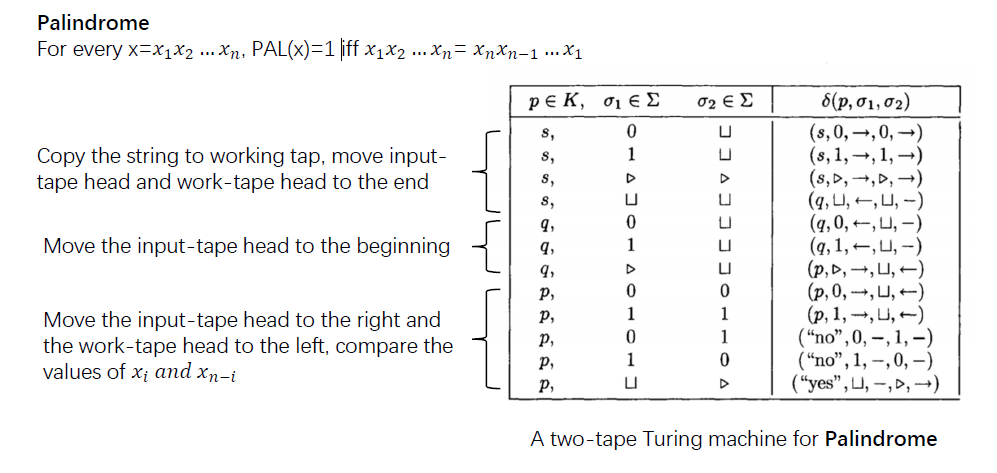

计算理论：
1. 研究算法：研究某特定算法的计算资源消耗（主要是upper bound）
2. 研究复杂度：研究某特定问题所需的最低计算资源（lower bound）

学习数学，重要的是基于某些概念的思考（live the life of those definitions），这使学者内化新的看待问题的视角。

> 教材，Computational Complexity, A Modern Approach. Sanjeev Arora, Boza Barak
> 
> Mathematics and Computation Avi Wigderson. 比较新，可能更通识一点。
> 
> Computational Complexity, Christos. 更老一点，质量更好，但是内容少一点。

## Computational Model: 什么是计算？

计算可以非常广义。"Computation is the evolution process of some **environment** with a sequence of **simple, local step**". Like, 大脑中的神经元，细胞中的蛋白质...

1. Lambda Calculus. 
2. Turing Machine.
3. Game of Life. 
   1. 诞生规则：空方格周围若有3个方块，则诞生
   2. 存活规则：某方块周围若有2/3个方块，下一刻仍然存活
   3. 死亡规则：否则方块死亡

三者之间等价，可以互相模拟。比如图灵机与生命游戏：建立一维纸带与二维世界的关联，图灵机摹拟生命游戏。间隔的“滑翔机”序列代表零一串，并可以找到一些pattern去进行逻辑运算。—— 可以最终变得很复杂。

## 图灵机

图灵机M使用$\Sigma, Q, \delta$定义，分别是有限的符号表（一般使用$\{0, 1, \sqcup, \rhd\}$，$sqcup$表示空，常常作为输入结束的标识，$\rhd$作为输入的起始标识），有限的寄存器状态集合，转移函数。

我们讨论的图灵机具有k条纸带的区分（每一条纸带对应一个读写头）（状态转移函数也就要考虑k个读写头的输入）。不同数目的纸带在可计算性意义上有O(n)的数量级差异，当一个问题需要缓存多个数据的时候，为讨论方便，常常一个数据一个纸带。

纸带的长度是无限的，若有限，则退化为有限自动机。

### 图灵机编程示例：回文串判断

图灵机编程，实际要给出$Q, \delta$的定义。

考虑一个二进制回文串判断问题，使用长度为2的纸带：
将输入串复制到第二个纸带上（赋值状态），（然后需要调整读写头，调整状态），顺序比较（比较状态）。比较过程，如果未到结尾出现了不一致，则转换至“错误状态”，若抵达结尾，则转换至“正确状态”。

> 单纸带O(n)，双纸带O(n^2)

### 在图灵机上定义计算与运行时间

计算（某个函数$f: \{0, 1\}^* \rightarrow \{0, 1\}$）：对于每个函数的作用域元素x，当图灵机M初始化为x，它最终终止地在输出纸带上书写了f(x)。

运行时间定义为图灵机上的step。我们说M在$T(n)$时间计算$f$，那么T(n)是一个上界，它要求对于每个输入x，都最多需要T(|x|)步。（这里的T的含义感觉不是特别明确，就用Big-O Notation即可）

Big-O Notation, 注意是上界还是下界（$O, \Omega, \Theta$）。small-o notation，不包含等阶关系的O关系（$o, \omega$）。需要注意，O允许的c，是对于所有输入都一致的，而非对于每一个输入都能找到一个c即可。

### 图灵机的鲁棒性

任何一个可以被某字符表为$\Gamma$的图灵机M计算的函数f:{0,1}* -> {0,1}*，如果时间是T(n)，它一定可以用一个字符表只包含{0, 1, empty, start}的图灵机计算，时间上界增加一个$log|\Gamma|$（4log|\Gamma| T(n)）。常数是由于要多走几遍。

Intuition: 原字符集可以用二进制字符集encode。

> 疑惑，这里的f是的作用域是{0, 1}*，不是\Gamma... TODO

**线性加速定理**：任何时间为T(n)的图灵机计算，其高阶的常数都可以变得任意小（通过扩充字符集，状态，状态转移函数）。（需要保留扫描的线性复杂度，$T'(n) = \episilon T(n) + n + 2$.）。这会使机器变大。

> TODO: 加深对linear spead up的直觉理解

图灵机对于字符集有鲁棒性，同时，也对于tape count有鲁棒性。single tape和k tape对于相同计算的时间复杂度，差距在5kT(n)^2。

### 通用图灵机

图灵机可以用字符串表示，我们可以考虑设计一个图灵机去计算任意一个输入的图灵机的解。

> 一个图灵机可以找到n种等价表示。

高效通用图灵机：
存在通用图灵机U，其输入可以写为U(x, a)，其中a是另一个图灵机（记为$M_a$）的字符串表示，x是该图灵机的输入。如果$M_a$在T步停下，那么U(x, a)在CTlogT步停下（C只取决于$M_a$的字符集大小、状态多少、tapes数量，与|x|无关）。

> 不需要知道为什么，构造这个高效图灵机需要技巧。

### 不可计算性

存在不可以被任何图灵机计算的函数UC：{0, 1}* -> {0, 1}.

构造证明：假设一个函数UC(a)，如果$M_a(a)=1$，then UC(a) = 0, else UC(a) = 1.（也就是说，一个如果输入字符串可以被解读为图灵机，且以自身为输入能得到1；如果输入字符串不是图灵机，则解读为0）（UC这个函数在判断一个图灵机是否是自确认的（自己作为自己的输入，得到1（它需要自己是一个图灵机）），如果是，输入0，否则输出1（也就是$M_x(x) 总是!= UC(x)$））.我们假设这个函数UC是被M_x可计算的（也就是$M_x(x) = UC(x)$）。矛盾。

> 证明可以理解，但其背后在说明的问题还需要进一步感悟。

构造证明：停机定理
函数HALT(a,x)用来判断图灵机a在x上是否会有限步停机。

构造证明：哥德尔定理。

### Church-Turing Thesis

任何一个可以物理上实现的计算设备，都可以由Turing Machine模拟.

> 强版本：在多项式overhead内模拟。

“如果说有一件事机器不能做，那么我们无法说清楚这件事要怎么做。”。