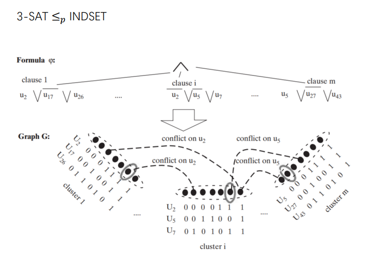

为了方便，这门课暂只关注“布尔函数”所表示的计算（即输出只有一个bit，输入只考虑01串），这种函数定义了一个决策问题，或称为一个“语言”。我们说一个机器定义了一个语言$L\subseteq \{0, 1\}$，当其表示的函数$f_L: \{0, 1\}^*\rightarrow\{0, 1\}$满足$f_L(x) = 1\Leftrightarrow x\in L$.

# P, NP, NP completeness

## $Time(T(n))$ 与 $P$

关于时间的复杂度类 Time(T(n))，n为输入大小，T(n)是一个关于n的函数（比如多项式，指数函数等）。我们称$L\in Time(T(n))$，当且仅当我们*可以找到一个图灵机*决定L，且其运算时间在$cT(n)$以内（c为常数）。

此时可以定义P：$P = \cup_{c\geq 1}Time(n^c)$. 即所有多项式时间可计算的语言（代表着问题）集合。

> 一些讨论：P定义在worst-case上，可能过于严格；离散输入没有考虑精度问题，随机性，量子计算，弦论...；决策问题可能过于局限（搜索问题）

$P$ 意味着 efficiently solvable

## $NP$ - nondeterministic polynomial

NP: 若一个语言L属于NP，那么我们能找到一个多项式p和*多项式时间图灵机*M，对于每一个句子x，都存在一个certificate $u$（size有多项式界$p(|x|)$），使得$M(x, u) = 1$.

也就是对于每个解x，我们都能在多项式复杂度内，确定其正确性（x属于L）。certificate可以理解为证明（验证）过程，M可以理解为通用图灵机（应该也有其他理解方法？图灵机与certificate的含义要配合理解）。TODO，可以再基于后述具体的NP问题，回归其NP的定义。

> 或者要看作一类新的问题，检查某个依赖其他字符串的属性。

$NP$ 意味着 has efficiently verifiable solution.

比如：

1. 图同构问题
2. 合数验证问题
3. 求质因子问题（分解大整数问题）
4. 定理可证问题

P 是 NP的子集：M就用P可以找到的哪个多项式，每个certificate为空。

## $EXP$

$EXP = \cup_{c\geq 1}Time(2^{(n^c)})$

NP是EXP的子集：构造图灵机M'，它对于每个x，用指数时间（$2^{(p(n))}$）遍历寻找u（用多项式时间用M去验证u是不是x的certificate），如果找到则输出1，否则输出0。验证步骤不影响指数的复杂度。

## 语言间的关系：Reductions

若语言L可以以多项式时间规约到另一个语言L'（以$L\leq_p L'$标注），当存在一个多项式复杂度的函数f，可以将每一个$x\in L$构造为一个L'中的句子f(x)。$x\in L \Leftrightarrow f(x)\in L'$。值得注意的是，L'中可能有更多的句子（集合的势更大）。

NP-hard: 一个语言是NP-hard，当每一个NP的语言都可以归约到它
NP-completeness: 既是NP-hard又是NP的语言

一些定理：

1. reduction具有传递性
2. 如果存在一个NP-hard语言属于P，那么P=NP
3. 如果一个语言是NP-complete，那么它属于P当且仅当P属于NP

问：存在NP-complete语言吗？存在，TMSAT, 它计算一个图灵机在某个输入上是否有一个n长度的验证，验证步骤在t以内。

> 证明：这个构造方式天然就是NP的。输入的大小和时间已经有线性关系了。
> n -> p(|x|), t -> q(|x| + p(|x|))
> TODO

### CNF formula(合取范式) and SAT

CNF formula: `(x1 \/ x2) /\ (not x1 \/ x3 \/ x4)`...

k-CNF formula: 每个括号最多有k个literal的CNF公式

SAT：所有可满足的CNF formula构成的语言

k-SAT：所有可满足的k-CNF formula构成的语言

SAT 和 3-SAT 是 NP-complete.

> 与或非的universality: 对于任意的l长度输入的布尔函数，都能构造一个$l2^l$长度的CNF公式准确表达它（就是遍历输入，把真值表打印出来）（长度以and or数目为单位）。

SAT到3-SAT的规约：将更长的合取式通过引入新变量的形式拆开。TODO

2-SAT in P：可以规约成有向图上两点间路径存在问题。TODO。一个clause中，一个数取0，另一个必须取1，这是很强的限制。

Max-2-SAT is NP-complete: TODO

> TODO: SAT, 2-SAT, 3-SAT本质的差别需要思考。

3-SAT可以规约为独立集问题：每一个clause，被视为7个可能取值组合（映射为图的7个点）相同clause中个体只能存在一个（相当于七个点全连接），根据不同clause的关系构建个体的conflict关系（clause中的点若与另一个若有冲突，连边），最后我们去找是否有一个大小等于clause数目的独立集。

> 每个clause映射为7个点（去除会使clause为false的点），每个点对应于一种使得该clause为true的三个变量的取值组合；边根据这种方式构建：同一个clause对于的7个点全连接；不同clause中的点对应的取值组合若有冲突（相同变量，取值不同）则连边。对于得到的这张图，我们求clause数目的独立集大小。如果存在，意味着每一个clause都有一种彼此不冲突的取值组合，使得自己为true，这也就使得3-SAT公式的值为true。当3-SAT公式为true时，我们也一定可以为每个clause找到一个取值组合使其为true，并且不同clause的取值彼此不冲突。

## coNP

NP定义的存在变成任意。

可以理解为这一类问题：判断一个东西，是否关于所有其他东西，都满足某个性质。这个性质，常常是否定式性质，比如，对于一个公式，它是不是“不可满足”的。

## 作业

必须要借助作业建立直觉啊... 做了好几天...

不得不先以作业为导向，课件还是有一些没有完全理解，再复习时做。
