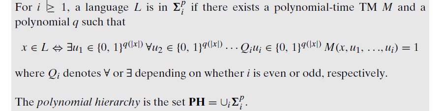
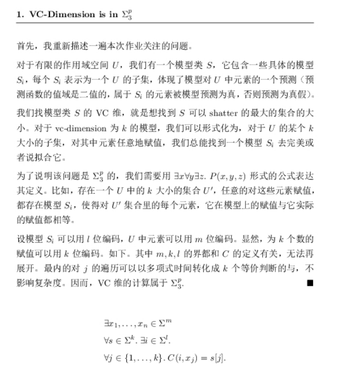
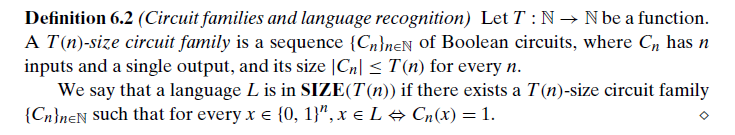
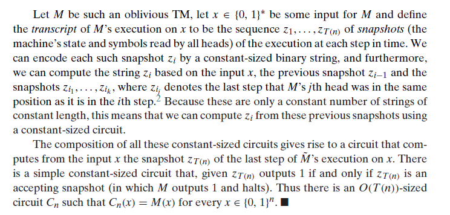
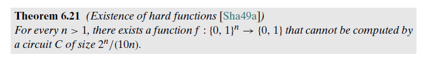
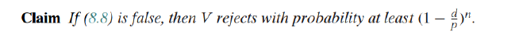
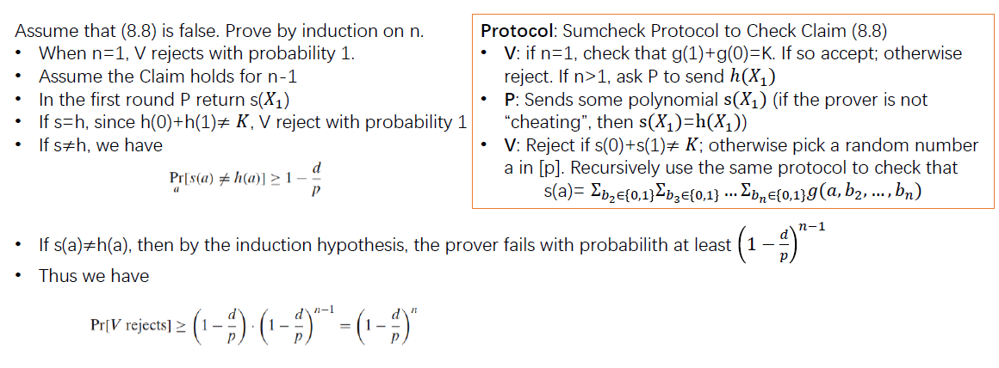
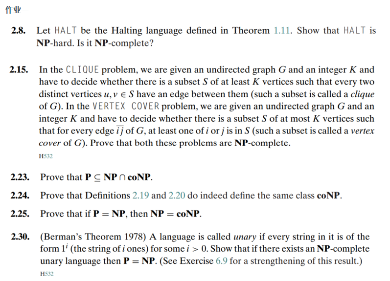

# 面向期末

## 规约

掌握定义，应该要实际规约一个问题，可能是3SAT到CLIQUE（OK）

## P/NP

定义（OK）

$coNP=\{L:\overline{L}\in NP\}$ ，其中$\overline{L}$表示$L$的补集

$coNP:x\in L\Leftrightarrow \forall u\in\{0,1\}^{(|x|)},M(x,u)=1$

两个定义等价，证明：其实就是根据定义拆开，取反，就得到了

## NPC&NP-hard

定义

## 对角化

**$P\not\subseteq \textit{EXP}$ 的证明**

> Time Hierarchy Theorem: 两个（time-construcible）函数f, g，满足f(n)log(f(n))=o(g(n))，那么Time(f(n))$\subset$Time(g(n)). 用额外log时间模拟，对角线取反构造新图灵机，这个图灵机与所有被模仿的图灵机都不同（也就不在对应的类中了）

结论，若P!=NP，两者间存在语言

ladner's' theorm, 理解，不需要知道怎么证明

> 若P is not NP, 则存在夹在NP和P之间的非NPC的语言（$L\in NP\backslash P$）

## poly hierarchy

$\Sigma^p_i$, $\Pi_i^p$, PH 概念

$\Sigma_i^p$ 的定义：量词从$\exists$开始.  $\Sigma_1^p = NP$

$\Pi_i^p$ 的定义：$\Pi_i^p=co\Sigma_i^p=\{\overline{L}:L\in\Sigma_i^p\}$, $\Pi_1^p=coNP$

$PH = \cup_i\Sigma_i^P=\cup_{i>0}\Pi_i^p$

著名的结果：某两层相等（i, i+1），hierarchy就会坍缩至第i层. 如果NP=P，PH=P。

证明（后者）：

归纳式地在i上证明。$\Sigma_i^p$可以用$\Pi_{i-1}^p$构造（得到一个NP的图灵机），由P=NP，得比它大得每一个都探索。（base 是 i=i）

证明VC-D$\in \Sigma_3^p$：

## Bool Circuit

定义：有向无环图，n sources, 1 sink. 中间节点是gates. size 指其节点数目。Fan in，节点的入边；Fan out，节点的出边。Depth，深度。

non-uniform 的计算模式，明确其与图灵机模型的区分 —— 可以做许多事情，“许多不可判定的语言”

T(n)界的布尔电路族：每一个长度的输入，对应一个电路，n长输入的电路的大小在T(n)界内

> 我觉得它更强，是因为每个电路都直接知道输入长度这个信息了，并可以将此信息与输出的关联直接编码于电路中。相当于免费地计算了无限个信息。这个信息可能很重要，以至于用图灵机无法很好地计算。TODO

$P_{/poly}$ 的定义：$\cup_c\textbf{SIZE}(n^c)$

$P\subseteq P/poly$

1. 只需要说明所有T(n)时间的oblivious TM（任何图灵机都可以以较低代价规约到它），都具有一个T(n) sized 电路族：编码M在输入为x时的动作序列，这个序列的界是T(n)，编码也就需要T(n)->电路。（不对，说的不全）
   
2. unary language在P/poly中（和容易给每个长度的输入串一个circuit），但不在P中

### 6.21: existence of hard functions: 的确由函数的计算需要大的电路

1. 考虑$\{0,1\}^n\rightarrow\{0,1\}$的函数，有$2^{2^n}$个，因为输入的空间是$2^n$（也就是真值表的行数），每一个输入都有两种可能取值。
2. 我们考虑限制电路大小为S，看这种限制下能编码的函数有多少，如果S很大时（也就是$2^n/(10n)$）可编码的函数数仍然不足$2^{2^n}$，则必然存在函数不能被大小为S的电路计算（因为总有一个电路可以计算它（不考虑size），所以意味着需要更大的电路）. 编码一个电路需要$9S log S$ bits. 所以电路总数最多有$2^{9SlogS}$个，带入S，不够。

## 随机计算

BPP定义：$\{L|\exists M,p,\forall x\in\{0,1\}^{*},\textbf{Pr}_{r\in_R\{0,1\}^{p(|x|)}}[M(x,r)=L(x)]\}$，其中r是一个随机bit序列（关于每一步）. M自然是多项式时间的图灵机.

error是怎么降下来的，定理7.10：
对于一个正确概率保证在$0.5+n^{-c}$的概率图灵机，我们构造一个新的概率图灵机，它操作旧图灵机k次，并取多数结果作为自己的结果。我们尝试去看这个新图灵机的正确概率的界。

利用chernoff bound：$\textbf{Pr}[|\Sigma_{i=1}^kX_i-pk|>\delta pk]<e^{-\delta^2 p k /4}$, 左右减1，左边变为$(1-\delta)pk\leq\Sigma\leq(1+\delta)pk$的概率。取$p=0.5+|x|^{-c}, \delta=|x|^{-c}/2$，左边的概率被放缩，一定意味着$\Sigma>k/2$，也就是新图灵机此时一定输出正确结果。这时看右侧，代入，比2/3更大。

> 不清楚$\delta$为什么要取这个（放缩时看起来并不直接）... 而且感觉要求的概率和输入长度有关系也感觉怪怪的。
> 书上的意思是，用这个$\delta$，应该可以比较准确地放缩到$2^{-|x|^d}$,取$k=8{|x|}^{2c+d}$. p就看作是$0.5$.

## 交互式证明

[维基百科](https://zh.wikipedia.org/wiki/%E4%BA%A4%E4%BA%92%E5%BC%8F%E8%AF%81%E6%98%8E%E7%B3%BB%E7%BB%9F)
对交互式证明的直觉讲的还是蛮好的... （对于NP问题，prover可以看作是EXP的）（相当于checker和searcher分离，集中考虑checker）

Sum check protocol?

> 去检查一个d阶多项式，遍历所有输入，得到的和是否为某个数字K（允许运算中保持mod p）.
> protocol：递归地检查
>
> * V: n=1, check g(1) + g(0) = k. n>1, ask p to send h(x1)
> * P: send s(x1) (should be h(x1) -- 对于合法的prover)
> * V: check s(0) + s(1) = k. 不等则拒绝，等于，则check子问题h(rand mod p) = g(a, ...)【此时少了一个变量】

PSPACE = IP 是一个很重要的结论，为了证明它，研究了许多有用的结论.

证明：induction on n. 最主要一步是prover返回的s is not h时，verifier可以发现两者不同的概率是$1-d/p$（这一点不是很确定，先强行记住吧）

## PCP

verifier是poly的。(r(n), q(n))-PCP，r(n)指随机bit的界，q(n)指可以访问的certificate的长度的界

1. P = PCP(0, 0)
2. P = PCP(0, log(n))：需要看log的certificate：可以用P时间遍历
3. NP = PCP(0, poly(n)). 不用随机位，看多项式位数的certificate

PCP theorem: NP = PCP(logn, 1).  "every NP language has a highly efficient PCP verifier"

hardness of approximation... 

> WM - HD 性质

# 作业

两个作业整理一下。
