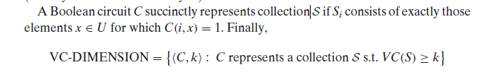

# 面向期末

## 规约

掌握定义，应该要实际规约一个问题，可能是3SAT到CLIQUE（OK）

## P/NP

定义（OK）

$coNP=\{L:\overline{L}\in NP\}$ ，其中$\overline{L}$表示$L$的补集

$coNP:x\in L\Leftrightarrow \forall u\in\{0,1\}^{(|x|)},M(x,u)=1$

两个定义等价，证明：其实就是根据定义拆开，取反，就得到了

## NPC&NP-hard

定义

## 对角化

**$P\not\subseteq \textit{EXP}$ 的证明**

结论，若P!=NP，两者间存在语言

ladner's' theorm, 理解，不需要知道怎么证明

> 若P is not NP, 则存在夹在NP和P之间的非NPC的语言（$L\in NP\backslash P$）

## poly hierarchy

$\Sigma^p_i$, $\Pi_i^p$, PH 概念

$\Sigma_i^p$ 的定义：量词从$\exists$开始.  $\Sigma_1^p = NP$

$\Pi_i^p$ 的定义：$\Pi_i^p=co\Sigma_i^p=\{\overline{L}:L\in\Sigma_i^p\}$, $\Pi_1^p=coNP$

$PH = \cup_i\Sigma_i^P=\cup_{i>0}\Pi_i^p$

著名的结果：某两层相等（i, i+1），hierarchy就会坍缩至第i层. 如果NP=P，PH=P。

证明（后者）：

归纳式地在i上证明。$\Sigma_i^p$可以用$\Pi_{i-1}^p$构造（得到一个NP的图灵机），由P=NP，得比它大得每一个都探索。（base 是 i=i）

证明VC-D$\in \Sigma_3^p$：

## Bool Circuit

定义：有向无环图，n sources, 1 sink. 中间节点是gates. size 指其节点数目。Fan in，节点的入边；Fan out，节点的出边。Depth，深度。

non-uniform 的计算模式，明确其与图灵机模型的区分 —— 可以做许多事情，“许多不可判定的语言”

T(n)界的布尔电路族：每一个长度的输入，对应一个电路，n长输入的电路的大小在T(n)界内

> 我觉得它更强，是因为每个电路都直接知道输入长度这个信息了，并可以将此信息与输出的关联直接编码于电路中。相当于免费地计算了无限个信息。这个信息可能很重要，以至于用图灵机无法很好地计算。TODO

$P_{/poly}$ 的定义：$\cup_c\textbf{SIZE}(n^c)$

$P\subseteq P/poly$

1. 只需要说明所有T(n)时间的oblivious TM（任何图灵机都可以以较低代价规约到它），都具有一个T(n) sized 电路族：编码M在输入为x时的动作序列，这个序列的界是T(n)，编码也就需要T(n)->电路。（不对，说的不全）
   
2. unary language在P/poly中（和容易给每个长度的输入串一个circuit），但不在P中

### 6.21: existence of hard functions: 的确由函数的计算需要大的电路

## 随机计算

BPP定义，error是怎么降下来的，定理7.10

## 交互式证明

PSPACE = IP 是一个很重要的结论，为了证明它，研究了许多有用的结论（？）

Sum check protocol? 8.3.1

## PCP

定义，极端情况

1. P = PCP(0, log(n))
2. NP = ?

WM - HD 性质？

# 作业

两个作业整理一下。。
