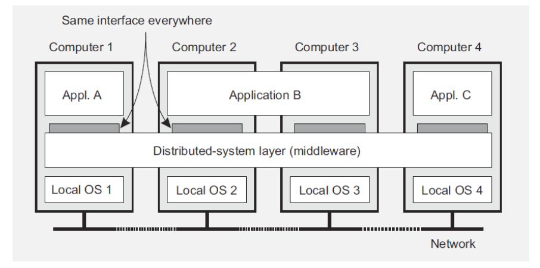

两本书：

1. Andrew S. Tanenbaumand Maarten van Steen, Distributed Systems: Principles and Paradigms, 2nd edition, Prentice Hall, 2007. 有第三版，电子版免费
2. George Coulourisetc., Distributed Systems: Concepts and Design, 4th edition, Addison-Wesley, 2005.

***

分布式系统：为某单一功能（目的）协同工作的，一系列的自主的计算组件。协同工作所以可能，因为中间件。

比如硬件池... （更多例子）

前沿：网络，处理器，内存，存储，协议

出于许多原因会使用分布式（而非大型计算机（mainframe））：
1. 经济上，微处理器性价比更好（？）
2. （可能）具有更大的计算潜力
3. 一些应用本质上就涉及空间上独立的机器
4. 可靠性
5. 可拓展性，可以慢慢增加机器

分布式系统的目标：
1. 相对于用户的透明性（访问方式、资源位置/移动、资源共享、失误与修复）
2. 分布式系统间的开放性（openness），至少相互交互不必以来底层环境的异质性

### 策略与机制

理想上，分布式系统仅提供某些机制（按需选择策略）即可：
1. 动态调整缓存策略的机制
2. 对便携（mobile）代码提供不同的信任级别
3. 对每个数据流可以调整QoS（服务质量）参数
4. 提供不同的加密算法用于交互

### 可拓展性

三个维度：
1. 用户数量、进程数量（size）
2. 地理距离
3. 自治区数量

（后两者是今天的挑战（？））

### 分布式系统的类型

1. 分布式计算系统
2. 分布式信息系统
3. 分布式普适系统（？）

集群计算（一般是同构的），网格计算（next step: lots of nodes from everywhere）

> 网格计算关注将大问题分成许多小问题，利用大量异构计算机的未用资源

云，云平台

分布式信息系统：transaction的保持

普适计算，许多许多小机器blends into environment，移动计算系统，传感器网络等等

### 一些例子

互联网，局域网，移动网络，Web（借助互联网传到各地）（每一个web服务是一个小系统（内在便会有一些分布式特征），是网络层之上的应用，并且可以相互联系交互）

> 无线网只有手机到电塔这一步是无线的