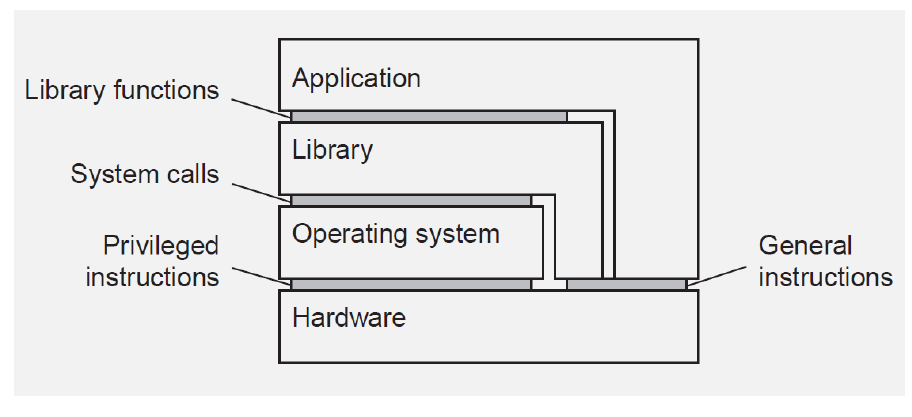
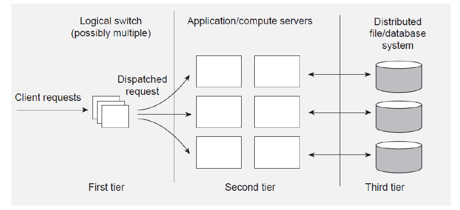

# process

process: **dynamic** instance of code and data. 强调进程的动态性，对比于程序本身。一个程序（实例化的一个进程）可以动态调用许多其他程序（实例化为进程）去完成某工作。

MMU，memory manager unit，涉及虚存有关处理。这部分有些忘了...

process 比 thread 更重。user-level thread / system-level thread(降低效率，但是可以更好地处理系统级时间（scheduling, external events...）). 工程上，暂时不结合两者. Thread实现：在kernel中有一些LWP. 

线程共享地址空间。线程处于一个“execution stream”中. 就是一些语词...

## threads & distributed system(servers)

1. 降低网络延迟（每个线程都发送同步的网络访问，由os去掩盖blocking延迟——程序结构更简单，blocking比较容易理解）
2. 倍速，同时访问提供相同服务的多个服务器。

> 可以提升效率，也可以引致更好设计的程序结构: blocking + multithread(简化了控制流)

## 虚拟化 

虚拟化可以在许多层次发生，因为接口可以被不同的系统组件提供。Hardware/os/library/application，也就是可以虚拟化很多东西，虚拟化硬件，虚拟化操作系统，虚拟化库文件，虚拟化应用程序... 

process VM & VM monitors -- 后者是直接在硬件上的抽象，不依赖于操作系统（作为运行时运行某些东西），前者依赖于操作系统，是应用级别的，程序被编译至一种便携的中间代码。例子，javavm.

## Client-side software

处理分布式系统的透明性：
1. 访问透明（近端、远端访问差异性。大概就是格式的不一致，由client处理。）
2. 地址、迁移透明（client处理）
3. 错误透明，一般只client处理
4. 重复访问透明（请求是否发给了多个server）

## Server

dispatcher thread + worker threads

types of servers: (没什么意思...) 
1. superservers: 支持多个独立服务的机器
2. iterative or concurrent

out-of-band communication: urgent message, 启用另一个port支持. TCP 是支持connection中具有urgent msg的。

stateless: server 不再记录 client 信息. 有许多好处（独立对于系统和开发的工整性有好处），缺点，丧失一些性能优化潜力，因为不能对某个用户的接下来行为进行预测了（比如猜测用户会取某个数据，预取上来）。

> 或许潜在地，在前一个request结束之前，可以做一些什么....

stateful: 记录用户已经缓存的内容，允许用户使用本地信息；跟踪用户以前的行为。效率可能会很高。

服务器集群：三个层次
1. 用户逻辑层，dispatch request. dispatcher 可以只做配对任务，不跟踪后续的client/server通信（不做中转）。
2. 各种“微”服务
3. 分布式文件系统、数据库

## 代码迁移

作用：server 端资源（核心是代码）拿到本地，可以避免通信，可以减少server负载。

需要建立关系的内容：
1. 代码段
2. 数据段
3. 执行状态

可以只迁移前两者，若迁移，代码被目标client独立执行。

强迁移，将进程复制下来，移动（直接或间接地），重新执行。

有一些server端资源（比如用户的其他数据，cache，...）没有办法拿过去。对资源分类：
1. fixed: 比如硬件资源，没有办法被拿过去
2. fastened: 高代价移动的信息
3. unattached: 可以被随意移动的信息

需要建立访问与（理解为主要是难以迁移的）资源的关系：通过标识符/值/类型... 根据需求关系，具体场景具体分析。

向异构系统迁移遇到问题：代码可能无法执行。处理方案：
- 使用带VM的语言
- 虚拟机