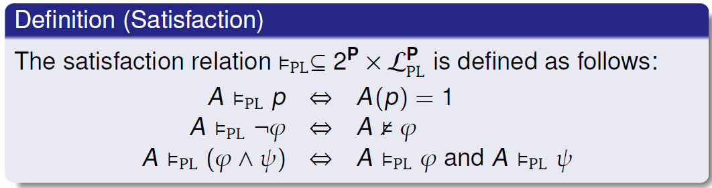
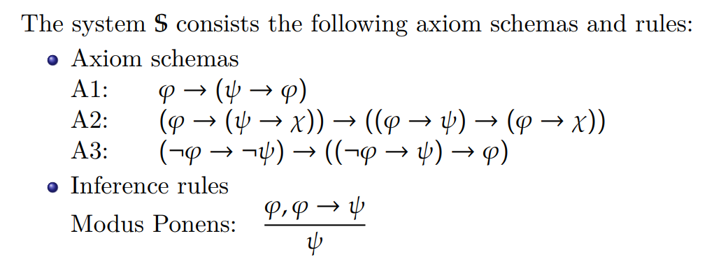
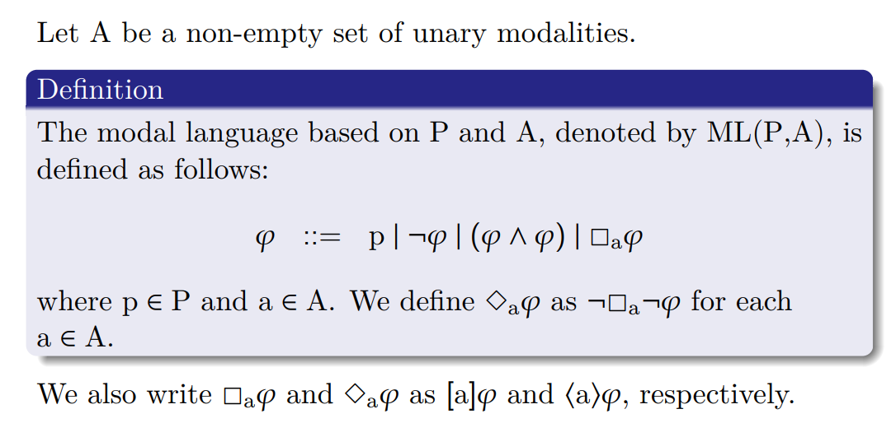
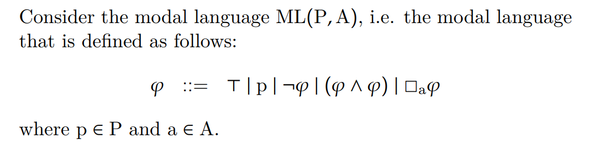

# Modal Logic I, Introduction

逻辑研究推理的形式（forms of inferences），then how to characterize valid forms of inferences
1. 确定formal language, 定义形式上合法的基本命题
2. 定义语义，建立推理系统。所有语义正确的（为“真的”）命题 都能用某 推理系统证明，称为completeness；若有用推理系统证明的语句，都是语义正确的的，这称为soundness.

这与“设计一个程序逻辑”，实际是一样的，因为都是“逻辑”。

## Propositional Logic，命题逻辑

### 语法：

$$

\phi ::= p | \neg \phi | (\phi \wedge \phi), where\;p\in P.

$$

p指原子命题，它属于一个预定义的非空原子命题集合P。这个语言被标记为$PL_P$.

我们只利用与非定义True（$\neg \perp$），False（$\perp = p\wedge\neg p$）, 或，蕴含，等价。

注意，False直接用排中律定义。

语言中每一个句子，都是一个formula（公式）.

### 语义：

相对于程序逻辑，命题逻辑的语义是简单的：它就是“真”或“假”，它没有“操作”的含义。当然，一个命题的真假受决定于原子命题的取值——原子命题的取值可以理解为“状态”。

> 每个命题逻辑语句，描述的不是要对状态做的变化，而是描述状态本身，大致对应assertion logic。如果语句符合“状态”，则为真，不符合，则为假。

（TODO: 多种层次的真；对于命题逻辑，可以有“在一个赋值下为真”与“在任何赋值下为真”两种区分。对于模态逻辑，有“在一个点模型上为真”，在“某模型上任意点模型为真”，对于“某框架frame任意赋值都为真”，和对于“任意框架都为真”。）

Assignment：function $A: P\mapsto\{0,1\}$. 即是命题的“状态”、确定了每个原子变量的真值。

Satisfaction: $\models_{PL}\subseteq 2^P\times\mathcal{L}^P_{PL}$. 一个命题，在某个赋值下其值等于真，意味着它被满足。satisfaction是被结构递归定义的（应是要避免循环定义的，保证符号不断在减少，最终约化为true或false；TODO: 注意和公理系统的proof区分）。

> 注意：satisfaction的定义，用到了`and`，`not`，没有用到额外的东西（比如forall, exists）. 也就是propositional logic这个逻辑的语言的语义是基于“这个逻辑本身”的。
> 
> TODO: 一个疑惑，satisfaction是形式化的命题逻辑的语义？我们为什么要提出证明系统？我们为什么不直接根据语义的递归定义，证明某个语句的真假？
> 
> 对于Hoare Logic，程序语言的语义是其对状态的操作；proof system是triple的变换。

Logical consequence（逻辑蕴含）：一个公式（$\varphi$）是一个公式集合（$\Gamma$）的逻辑蕴含，记为$\Gamma\models\varphi$，当且仅当 $A\models_{PL}\Gamma$ implies $A\models_{PL}\varphi$，for any assignment A.

【这里有一个问题：$A\models_{PL}\Gamma$没有过定义！意思应该是在赋值A下，$\Gamma$里面的每一个formula都真吧】【应该是对的】

> logical consequence的可以使用的一个场景是：$\Gamma$是一个公理集设定，$\varphi$是定理；我们要证明定理是正确的。或者可以将$\Gamma$看作一个假设集，它并不需要恒为真，我们想看$\varphi$是否由其中分析得出。

> logical consequence 需要一个“任意”量词去定义。

$\varphi$ is valid(是恒真式(tautology)), 如果$\emptyset\models_{PL}\varphi$. 或写作$\models_{PL}\varphi$. $\varphi$对于命题逻辑恒为真.

### 命题逻辑的证明系统$\mathbb{S}$

包含：
1. Axiom schemas（不需要任何前提）
2. Inference rules（需要一些前提）

如：

> 公理系统是做什么的：语义的定义（如satisfaction），是将命题递归的翻译成语义模型、将符号映射到“含义”，符号不再被保留；公理系统是一些推导规则，借助它们对命题进行直接进行字符串的替换，而不用考虑其背后的语义模型。

一个公式$\varphi$是在$\mathbb{S}$、与公式集合$\Gamma$上 是可证明的（provable, or derivable），denoted $\Gamma\vdash_{S}\varphi$, 如果存在一个公式序列$\varphi_1 ...\varphi_n$，such that $\varphi_n = \varphi$ and that, for each $\varphi_i$ where 1 <= i <= n, 三选一：

1. $\varphi_i\in\Gamma$;
2. $\varphi_i$ is an axiom in $\mathbb{S}$;
3. $\varphi_i$ can be infered from previous using a rule of inference in $\mathbb{S}$.

### Soundness and Completeness

(Strong) Soundness: If $\Gamma\vdash_{\mathbb{S}}\varphi$ then $\Gamma\models_{PL}\varphi$. 【weak soundness这个性质指，“任何可以被证明系统证明的句子，都是符合语言的语义的”；不是很理解strong soundness的含义，好像就是logical consequence】若任何可以被$\Gamma$中语句derive的句子【什么叫“is deriveable from a set $\Gamma$?”，是和公理系统类似的方式吗？】，在该语言上都被$\Gamma$逻辑蕴含，他就满足(对于$\Gamma$的) strong soundness。【逻辑蕴涵是一个语义上东西，那么对应的语法上的东西应该就是 公理系统中的公式补充上$\Gamma$，相当于条件变强了。】

Strong Completeness: If $\Gamma\models_{PL}\varphi$ then $\Gamma\vdash_{\mathbb{S}}\varphi$. 对于每一个被$\Gamma$逻辑蕴含的语句，一定可以被 公理系统+$\Gamma$推理得到。$\Gamma$应该就是加到公理模式中。相当于公理系统更强了，所以strong。

(Weak) Completeness: $\models_{PL}\varphi$ then $\vdash_{\mathbb{S}}\varphi$. 任何满足语义的语句，都可以被公理系统证明。

> 我觉得“strong”没有啥用。

> completeness: 没错！严格表述的话——假如一个句子集可以满足一个句子，那么一定可以找到从给定的句子集到句子的推演序列！

#### 关于completeness的证明（命题逻辑的完全性证明）

定义：一致性（一个句子集具有一致性，当且仅当它不能同时证明一个命题以及它的否定（即，要求一个句子集是自洽的））和可满足性。

形式化可满足性：句子的真值与它包含的命题符号的真值的关系（structural deduction）。【首先要定义真值指派】。公式集$\Sigma$是可满足的，当且仅当存在一个真值指派s满足$\Sigma$.

statement的转换：命题逻辑系统的完全性成立，等价于“加入一个公式集$\Sigma$一致，那么它可满足”。

【这里需要证明；有一个命题还不清楚，TODO：“如果一个公式集是不一致的，则可以由它推理出任何命题。”】

我觉得我得重头看一遍数理逻辑。

## Modal Logic

> Modal Logic is a family of logics that study of the deductive behavior of modality. 研究引入模态词的一系列逻辑。模态词是对真值的修饰。

模态逻辑，就是在命题逻辑之上增加若干个模态词，我们一般考虑一元的模态词。

> 注意，虽然模态逻辑中没有量词、不包含一阶逻辑语言，但其语义是用到一阶逻辑的。

$$

\varphi ::= p\;|\;\neg\varphi\;|\;(\varphi\wedge\varphi)\;|\;\square\varphi

$$

And we define $\diamond$ as $\neg\square\neg\varphi$.

1. 在基本模态逻辑中，分别为必然、可能
2. 时序逻辑中，为“总是”，偶然
3. 道义逻辑中，为“应该”，“可以”
4. 认知逻辑中，为“已知”，（和“可知”？）

多个模态词可以同时存在。

模态词可以是任意元的：General modal language 可以用modal similarity type表示。

### 一些基本定理

对于这一类模态逻辑（含有若干个一元模态词）：

有以下定理。

1. P, A是可数的，则ML(P,A)是可数的。

> 语言的符号表$\Sigma$是有限的，语言是符号表的n次笛卡尔积的子集，（可数集上）有限次笛卡尔积运算维持可数性（笛卡尔积可以理解为有限次可数集上的并运算）。

2. ML(P,A) is uniquely readable. 即无二义性。

### 结构归纳法

1. 证明所有公式（formulas）都有特定的属性（比如：所有公式有相同数量的左右括号）。
2. 定义一个用于所有公式的函数。

### 克里普克语义：Kripke frame. 注意，不是可能世界语义。 

Kripke frame定义：$<W, \{R_a\;|\;a\in A\}>$，W是非空的可能世界集合，第二项是W上的二元关系。二元关系的性质决定frame的性质。【可以拓展到若干个二元关系】

Kripke model for ML(P, A): is a pair <F, V>

1. F is a frame for ML.
2. $V: W \rightarrow 2^P$ is an assignment. 【每个可能世界，都有自己的原子变量的取值】

对于每个可能世界，都单独构成一个点模型（pointed model）. (M, w)

Kripke Semantics for ML: 对于某个点模型$(M, s)$上的公式$\varphi$，我们说$\varphi$在模型$M$的w世界上被满足（is true），denoted $M,s\vDash\varphi$, 满足以下定义：

1. $M, w\vDash p\iff p\in V(w)$. 原子命题在该世界是正确的。
2. $M, w\vDash \neg\varphi \iff M,w\not\vDash\varphi$. 
3. $M, w\vDash(\varphi\wedge\phi)\iff M,w\vDash\varphi\;and\;M,w\vDash\phi$. 命题逻辑还是直观的意思
4. $M, w\vDash\square_a\varphi\iff \forall v.\;(w,v)\in R_a\rightarrow M,v\vDash\varphi$. “必然”意味着由关系决定的可能世界的后继，都要满足$\varphi$.

简记：Let $\Gamma$ be a set of formulas. We use $M, w\vDash\Gamma$ to denote $M, w\vDash\varphi$ for each $\varphi\in\Gamma$.

公式是公式集合的逻辑蕴含：$\Gamma\vDash\varphi$, iff the following condition is satisfied: for each $(M, w)$, if $M, w\vDash\Gamma$ then $M, w\vDash\varphi$.【和命题逻辑的logical consequence是一个意思】

我们称一个公式$\varphi$ is valid iff $\emptyset\vDash\varphi$, 或写作 $\vDash\varphi$. 也就是，$\varphi$在任何一个点模型上都为真。

命题逻辑是模态逻辑的子集，语法意义上与语义意义上都是。【这里的证明是复杂的。对问题形式化，我们要拆解多个量词，在运行结构归纳处理$\forall$时，要考虑好是哪个$\forall$】

> 这一部分的课上笔记在"口语"本子上...

注意：Frame 与 Model的区别。Model额外有$V: W\rightarrow 2^P$的赋值。

true/valid 分别在model和Frame上谈。

也注意模态词带来的local/global的区分：true at a state / globally true in a model; valid at a state / valid in a frame.

### Relational Structure 的性质 与逻辑的性质

如果F是自反的，那么$F\vDash \square p\rightarrow p$. 非自反，则不满足。