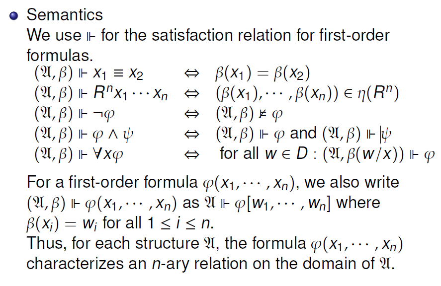
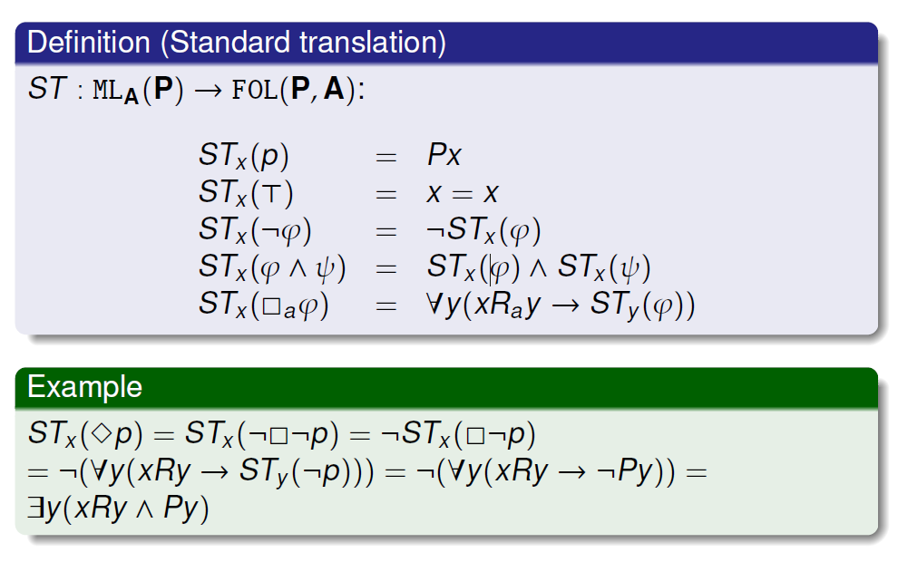

# 模态逻辑在模型上的定义能力

一个点模型类$K$如果是可被某公式$\varphi$定义的，当且仅当，$M, w\in K\iff M, w\vDash\varphi$.

可以被一个公式集$\Sigma$定义：$M, w\in K\iff \forall\varphi\in\Sigma.\;M,w\vDash\varphi$.

若K可以被$\varphi$定义，其补集可被$\neg\varphi$定义。（对于（无限）公式集，这一点不成立）。

模态逻辑在点模型上的定义能力：

1. 某个点模型类若可以被某个模态公式**集**定义，当且仅当，这个模型类是对互摹拟、超积封闭，且它的补集对超幂封闭。
2. 某个点模型类若可以被某个模态公式定义，当且仅当它和它的补集都对互摹拟、超积封闭。

逻辑的区分能力（distinguishing）与表达能力（expressive）：
1. 区分能力：如果任意可以被逻辑A的某个公式区分的两个模型，都可以找到一个逻辑B的公式区分，我们认为两者的区分能力，A <= B.
2. 表达能力：逻辑A中的每个公式，可以在逻辑中B中找到某个等价公式，意味着表达能力 A <= B.

表达能力是比区分能力更强的性质；偶尔，表达能力可以规约为区分能力。

> 命题逻辑，与原子命题具有相同的的区分能力。因为一个公式在两个“模型”（命题逻辑的模型就是原子命题的赋值）不同，就意味着存在一个原子命题在两者上的赋值不同。（表达能力，还是意味着“模型类的定义能力吧”QAQ）

## 与一阶逻辑的比较

$$
\varphi::=x_1=x_2\;|\;R^nx_1\dots x_n\;|\;\neg\varphi\;|\;(\varphi\wedge\varphi)\;|\;\forall x.\varphi
$$

其中$R\in\mathcal{R}$. 也就是关系集合。

一阶逻辑的结构：$(D, \eta)$，D是一个非空集合（论域），$\eta$是relations的赋值（relation是n元的）。对结构可以赋值，赋值$\beta$赋予每个自由变量$x_i$一个D中的元素。

语义：

### 我们可以将克里普克模型视为FOL的结构

世界集合 <-> 论域；可及关系 <-> 二元关系；赋值 <-> predicate（P(w)指，p在w上是否“为真”）.

> 【predicate还要理解一下，如果每个世界有好多个p呢..】

标准翻译：还是比较简单的。记录$p_i\in \mathcal{P}$都被翻译为$P_i$.

由于是点世界模型，Px的x，实际要被赋值为w.

standard translation保持点模型语义：$M, w\vDash \varphi\Leftrightarrow M\Vdash ST_X(\varphi)[w]$

也可以保持模型语义：$M\vDash\varphi\Leftrightarrow \forall x. ST_X(\varphi)$【$\forall x$，就是任意世界代替自由变元的意思】

### 因而，作为FOL的子片段，可以从FOL继承一些性质

1. 紧致性
2. Lowenheim-Skolem Theorem：一个模态公式集合，如果在某个无限模型是可满足的，那么它在任意一个无限模型（无论论域的势是多少）上都是可满足的。

### 什么样的FOL公式可以对应某个ML公式？

van Benthem Characterization Theorem：如果一个一阶逻辑（FOL(P,A)）公式，在bisimilarity下不变，当且仅当它等价于一个模态逻辑公式的标准翻译。

> 超积保持FOL.. 不重要！

