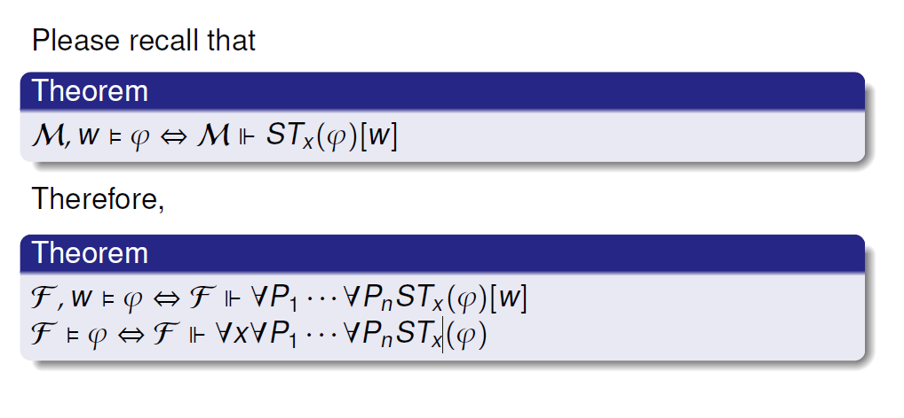

# 模态逻辑的框架定义能力

重要的模态逻辑**公理**，描述**框架**需要满足的直观性质。关联两者，允许我们对两者都更好了解。

## Frame constructions

bisimulation for frames: 去掉对赋值关系的规定。

此时我们仍有类似的frame constructions的概念.
### proof

## Frame definability

> 也可以是公式集

一个公式定义了一个框架类$K_f$：$\forall F.\;F\in K_f\Leftrightarrow F\models\varphi$. 【不能归约为点模型类定义能力，即$\varphi\;defines\;K_f\iff\varphi\;defines\;\{M,w\;|\;M\;is\;based\;on\;F\in\;K_f\}$【原因："这个模型类不是对bisimulation封闭的"，【忘记理解了TODO】【右到左是正确的，左到右不成立】】】

relative definability within C: $\forall F\in C.\;F\in K_f\Leftrightarrow F\models\varphi.$ 【相对可定义不意味着交集可定义】

一些性质：

$K_f$是一个有限的、传递的框架类，如果$K_f$在传递有限框架中是可被定义的，当且仅当它关于（有限的）“分离并，生成子框架，有界态射像”三个操作是封闭的。

Goldblatt-Thomason Theorem：一个一阶逻辑可定义的框架类，是模态逻辑可定义的，当且仅当它对“有界态射像、生成子框架、分离并、反射超滤拓张”是封闭的。【没办法理解QAQ】

### examples, proof

## Compare frame languages

与一阶逻辑比较：
1. 举例，FOL可定义，ML不可定义：
   * Total Connectedness, 全连接（$\forall x, y.\;(Rxy\vee Ryx)$. 【模态逻辑不能区分disjoint union变换】
   * 存在独立点，$\exists x\forall y(\neg Rxy\wedge\neg Ryx)$.【ML不能区分子框架变换（这是个什么变换？TODO）】
   * 反自反性，非对称性，反对称性，通过有界态射
   * 后继自反，借助超滤拓张。

    > 如果一个框架类可以被FOL公式定义，其补集也可以；
    但如果是被ML定义，就不可以。【应该是“赋值”的位置不一样吧】

2. 举例，ML可定义，FOL不可定义：

    * Lob formula: $\Box(\Box p\rightarrow p)\rightarrow \Box p$
    这个定义了R是传递的，且R的逆是良好定义（没有无限路径的）的框架。
    * McKinsey formula: $\Box\Diamond p\rightarrow \Diamond\Box p$ 这个好记。。

3. 也有都不可定义的，没有例子

4. ML => FOL：
   * Chagrova's theorem: 判断一个任意的模态逻辑公式，是否有一阶逻辑的对应公式，是undicidable的
   * Sahlqvist formula(符合一些特点的公式): 在点框架类的定义能力上，有一阶逻辑的对应公式；并且是可有效计算的。【是一个子集，别的公式也可以有一阶对应公式】
5. FOL => ML
   * Kracht theorem: 任何一个Sahqvist formula都和某个Kracht formula在点框架定义能力上对应；同时，任何一个Kracht formula也都与某个Sahqvist formula对应（也是可以被高效计算的）。

是MSO的子片段：【在一阶逻辑的翻译上，增加对一元谓词的量化（每个一元谓词，对应每个世界想要逻辑变元的映射关系）（也就是“任意赋值”...）】
1.  

