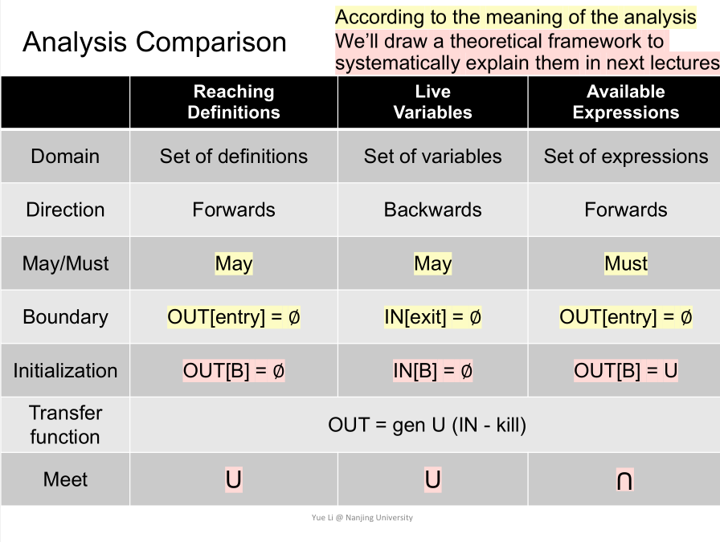

# Dataflow Analysis - Applications

这张图很好地概括了data flow analysis关注的概念：

1. 首先对关注的信息做abstraction. 
2. 进一步定义transfer function(每个BB在抽象域做的事)（如何操作abstract state）
3. 每个BB的输入可以是多个（多条输入边），需要定义整合策略，得到BB真正的IN
4. 设计中需要保证“safety”

注意，对于每个BB，有两个state，IN和OUT. 我们的transfer function可以是前向的（forward analysis），或者后向的（backward analysis）【前向和后向在算法设计上是对称的，思维方式有细微的差异】

## Reaching definitions analysis

> Focus on intra-procedural analysis. No variable aliases(need pointer analysis).

Reaching: definition d at `p` reaches `q`, if there is a path from `p` to `q`, such that `d` is not killed along the path. $D: v = x\;op\;y$

Killed: no new definition of same variable.

可以用于检查可能未定义即使用的变量。

Abstraction: 关注的信息：the definitions of all variables in a program. 可以用bit vec表示（每一个bit表示一个definition，而非一个variable name）。

Transfer function(forward): $OUT[B]=gen_B\cup (IN[B]-kill_B)$ 【需要计算每个BB的某些属性：每个definition kill 其他相同变量的definition，并gen它自己】【如果一个块内有同一个变量的多个声明，应该取最后一个就好？】

Control flow union: 输入的所有bit vec，按位或

算法：迭代式

* 所有OUT初始化为空集
* 不断迭代，直到没有OUT发生改变：重新计算每个BB的OUT. 【选取BB的顺序会影响迭代次数？】

为何一定会终止：OUT[S] never shrink(monotonicity). sets of state is finite. "Finally reach a fixed point."

## Live variables Analysis

Whether the value of variable v at program point p, could be used along some path in CFG starting at p? 在程序某个点（state），此时各变量的值，还会在以后被使用吗（直到重定义或程序exit）？

live variables information，可以用于register allocations.

Abstraction: All variables in a program - bit vector. （每个bit，不再是定义，而是变量）

我们的分析过程也变为反向。

Transfer function: $IN[B]=use_B\cup (OUT[B]-def_B)$. 其中use_B含义是：used before redefinition in B的那些变量. 

Control flow meet: $OUT[B]$简单取并集（按位或）

算法还是一样，全部初始化为空集，不断迭代，直到IN[B]不再变。

## Available Expressions Analysis(must analysis)

可以进行计算结果的复用.

Expression x op y is available at program point p: if (1) all paths from entry to p **must** pass through the evaluation of x op y(之前一定计算了该表达式). and (2) after the last evaluation of x op y, there is no redefinition of x or y(且该表达式的值被改变).

Abstraction: all expressions in a program. -> bit vec

Transfer function(forward): $OUT[B] = gen_B \cup (IN[B]-kill_B)$. $IN[B]$取交集（按位与）. $gen_B$指在块B生成的且在结束后还有效的表达式（变量没有在该表达式出现后重声明）.

算法：

* 初始化，entry为空集，其他为全集
* 不断迭代到没有改变

## Recap

三个算法分别是，may forward, may backward, must forward. 考察的分别是定义、变量、表达式。transfer function虽然很像，但gen/kill的计算不同（毕竟domain不同）。

注意初始化条件。注意终止性的证明。

